<div align="center">

<h1>😷 AI 기반 마스크 착용 감지 및 경고 시스템</h1>

<h3>실시간 얼굴 탐지부터 경고·원격 모니터링까지 연결한<br />4인 졸업작품</h3>

<p><strong>🧬 합성 데이터셋 &nbsp;·&nbsp; 🧠 CNN 이진 분류 &nbsp;·&nbsp; 📡 Raspberry Pi 2대 연동</strong></p>

</div>

---

카메라 영상에서 얼굴을 찾고 마스크 착용 상태를 실시간으로 분류한 뒤, 미착용 이벤트를 경고음과 원격 모니터링 화면으로 전달하는 시스템입니다. 단순한 이미지 분류 실험에 머물지 않고 **데이터 생성 → CNN 학습 → 영상 추론 → 장치 간 통신 → 현장 시연**까지 하나의 흐름으로 구현했습니다.

흰색·검은색 마스크, 정면·측면, 안경 착용, 코가 노출된 잘못된 착용을 데이터에 반영했습니다. 특히 잘못 착용한 마스크도 미착용으로 판단하도록 분류 기준을 설계하고, 두 대의 Raspberry Pi 사이에 영상과 이벤트를 전송해 분류 결과가 실제 장치 동작으로 이어지게 했습니다.

<a href="./assets/detection-results.jpg">
  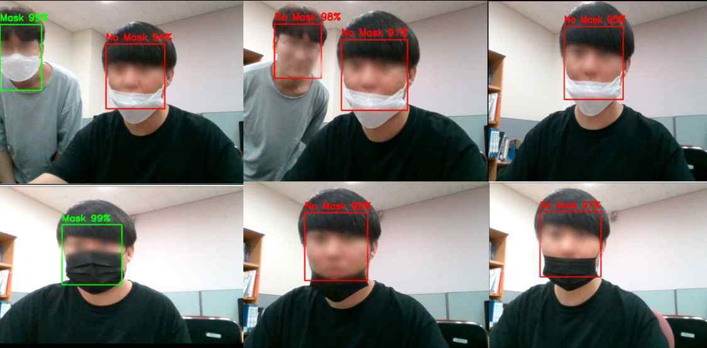
</a>

<p align="center"><sub>흰색·검은색 마스크의 올바른 착용과 코 노출·미착용을 구분한 최종 시연</sub></p>

| **12,000장** | **2개 클래스** | **Raspberry Pi 2대** | **통신 채널 2개** |
| :---: | :---: | :---: | :---: |
| 논문에 기록된 합성 데이터 | `Mask` / `No Mask` | 탐지 장치 / 모니터링 장치 | TCP 이벤트 / imagezmq 영상 |

> 논문명: **AI기술을 이용한 마스크 착용 감지 및 경고 시스템**<br />
> 프로젝트명: **아이즈 온 유(EYESONYOU)**

| 항목 | 내용 |
| --- | --- |
| 기간 | 2021.03 ~ 2021.12 *(보존 자료 기준, 학위논문 제출 2022.02)* |
| 구분 | 4인 졸업작품·졸업논문 |
| 팀 | 김진우, 민동진, 박병준, 최재혁 *(4인)* |
| 담당 범위 | 얼굴 데이터 수집, 랜드마크 기반 마스크 합성, Keras CNN 학습, Raspberry Pi 연동 *(4인 공동 구현)* |
| 핵심 기술 | Python, Keras/TensorFlow, OpenCV, Pillow, dlib, Raspberry Pi 4, TCP Socket, imagezmq |

## 🧭 목차

- [🎯 문제와 목표](#problem)
- [🏗️ 전체 시스템 흐름](#architecture)
- [🧬 데이터 준비](#data)
- [🔁 데이터를 고쳐 모델을 개선한 과정](#iteration)
- [🧠 CNN 학습과 실시간 추론](#cnn)
- [✨ 주요 기능과 실제 구현](#implementation)
- [🙋 담당 범위](#contribution)
- [🖼️ 실제 장치 시연](#device-demo)
- [🧪 실험과 검증 결과](#validation)
- [🧰 기술 구성](#stack)
- [📌 한계와 배운 점](#limitations)

<a id="problem"></a>
## 🎯 문제와 목표

마스크를 쓰고 있어도 코나 입이 노출되면 방역 효과를 기대하기 어렵지만, 사람이 모든 출입 영상을 지속적으로 확인하기는 어렵습니다. 이 프로젝트는 다음 질문에서 출발했습니다.

> **카메라가 올바른 착용 여부를 실시간으로 판단하고, 담당자가 놓치지 않도록 즉시 알릴 수 있을까?**

이를 위해 세 가지 목표를 세웠습니다.

1. 마스크 색상과 촬영 각도 변화에도 착용 여부를 구분합니다.
2. 코가 노출된 잘못된 착용을 `No Mask`로 분류합니다.
3. 분류 결과를 경고음, 발생 시각·카메라 정보, 원격 영상으로 연결합니다.

<a id="architecture"></a>
## 🏗️ 전체 시스템 흐름

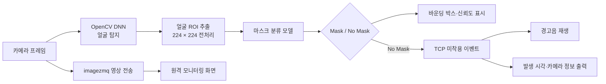

- **탐지 장치**는 카메라 프레임에서 얼굴을 찾고 마스크 상태를 분류합니다.
- **이벤트 채널**은 미착용 판단 시 `no_mask` 메시지를 TCP 소켓으로 전송합니다.
- **영상 채널**은 imagezmq로 실시간 프레임을 전달합니다.
- **모니터링 장치**는 중계 영상을 표시하고, 이벤트를 받으면 경고음을 재생하며 발생 시각과 카메라 정보를 출력합니다.

<p align="center">
  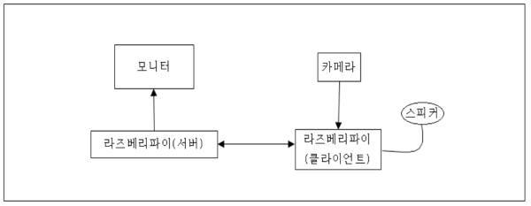
  <br />
  <sub>논문에 수록된 Raspberry Pi 2대 기반 시스템 구성도</sub>
</p>

<p align="center">
  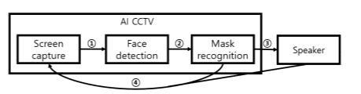
  <br />
  <sub>화면 획득 → 얼굴 탐지 → 마스크 인식 → 경고로 이어지는 처리 블록</sub>
</p>

<a id="data"></a>
## 🧬 데이터 준비

### 1. 식별 가능한 실사진 대신 합성 가능한 얼굴 데이터 활용

논문은 AI로 생성된 얼굴 이미지를 원본으로 사용했다고 기록합니다. 얼굴의 방향과 안경 착용 여부가 다른 이미지를 수집하고, 실제 사람의 개인정보 노출을 줄이면서 학습 데이터를 확장했습니다.

### 2. 68개 얼굴 랜드마크로 마스크 위치 계산

dlib의 68개 얼굴 랜드마크 중 턱과 양 볼, 코 주변의 기준점 `3·8·13·29`를 이용했습니다.

- `8 ↔ 29` 거리로 마스크 높이를 계산합니다.
- 얼굴 중심선과 `3`, `13`의 거리로 좌우 폭을 계산합니다.
- 턱과 코의 좌표로 얼굴 기울기를 구해 마스크 이미지를 회전합니다.
- Pillow와 OpenCV로 흰색·검은색 마스크를 얼굴 위에 합성합니다.

<a href="./assets/mask-synthesis-pipeline.svg">
  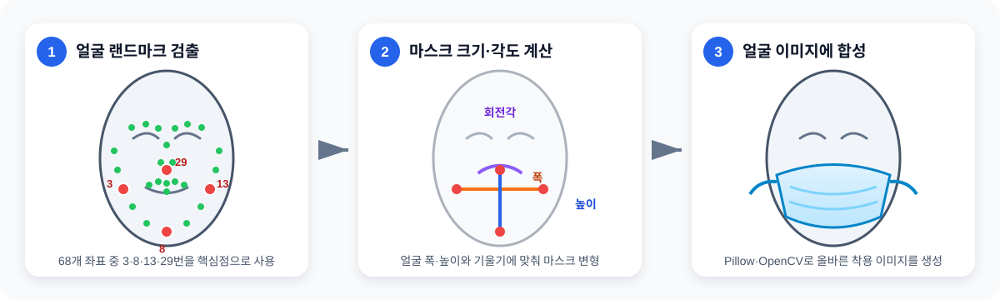
</a>

<p align="center"><sub>68개 얼굴 랜드마크 검출 → 핵심 좌표로 폭·높이·회전각 계산 → Pillow·OpenCV 합성</sub></p>

### 3. 올바른 착용과 미착용의 기준 정의

| 학습 클래스 | 논문에 기록된 구성 | 수량 |
| --- | --- | ---: |
| `Mask` | 흰색 마스크 3,000장 + 검은색 마스크 3,000장 | 6,000장 |
| `No Mask` | 흰색 코 노출 1,500장 + 검은색 코 노출 1,500장 + 미착용 3,000장 | 6,000장 |
| **합계** | 정면·측면과 안경 착용 사례 포함 | **12,000장** |

여기서 코를 내놓은 착용은 보호구를 쓴 모습이더라도 `No Mask`에 포함했습니다. 즉, 모델이 단순히 “얼굴 위에 마스크 모양이 있는가”가 아니라 **올바르게 착용했는가**를 구분하도록 데이터 기준을 정했습니다.

<a id="iteration"></a>
## 🔁 데이터를 고쳐 모델을 개선한 과정

모델이 처음부터 모든 착용 상태를 구분한 것은 아닙니다. 시연 중 발생한 오분류를 확인하고, 부족한 조건을 데이터셋에 추가해 다시 학습하는 방식으로 개선했습니다.

<table>
  <tr>
    <th width="40%">문제 장면</th>
    <th width="20%">데이터 보강</th>
    <th width="40%">보강 후</th>
  </tr>
  <tr>
    <td><a href="./assets/white-mask-before.jpg">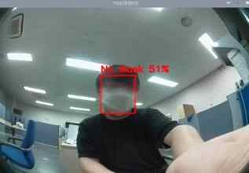</a></td>
    <td align="center"><strong>흰색 마스크</strong><br />다양한 착용 사례 추가<br />→ 재학습</td>
    <td><a href="./assets/white-mask-after.jpg">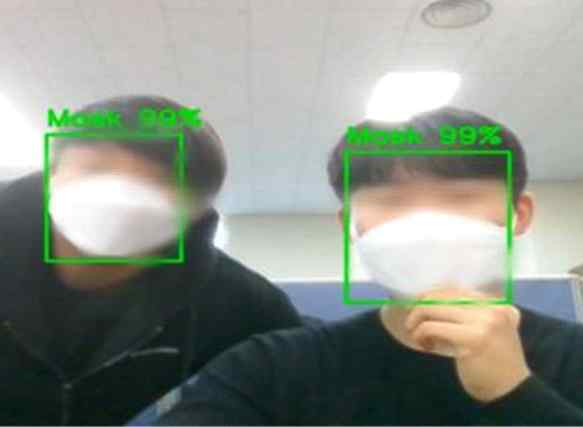</a></td>
  </tr>
  <tr>
    <td>초기에는 흰색 마스크를 <code>No Mask</code>로 판단했습니다.</td>
    <td align="center">색상·각도 조건 보강</td>
    <td>보강 후 시연 프레임에서 <code>Mask 99%</code>를 표시했습니다.</td>
  </tr>
  <tr>
    <td><a href="./assets/black-mask-before.jpg">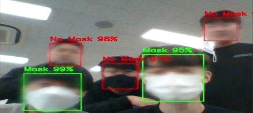</a></td>
    <td align="center"><strong>검은색 마스크</strong><br />색상별 데이터 추가<br />→ 재학습</td>
    <td><a href="./assets/black-mask-after.jpg">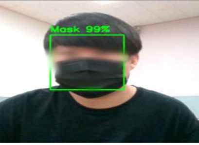</a></td>
  </tr>
  <tr>
    <td>흰색 위주의 데이터로는 검은색 마스크를 놓쳤습니다.</td>
    <td align="center">빛 반사를 고려한 합성</td>
    <td>검은색 마스크도 <code>Mask 99%</code>로 표시했습니다.</td>
  </tr>
  <tr>
    <td><a href="./assets/improper-mask-before.jpg">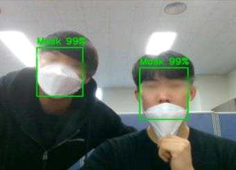</a></td>
    <td align="center"><strong>코 노출 착용</strong><br /><code>No Mask</code>로 라벨링<br />→ 재학습</td>
    <td><a href="./assets/improper-mask-after.jpg">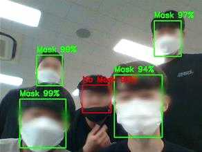</a></td>
  </tr>
  <tr>
    <td>코를 내놓은 상태를 정상 착용으로 판단했습니다.</td>
    <td align="center">분류 기준 자체를 보강</td>
    <td>보강 후 코 노출 대상을 <code>No Mask</code>로 구분했습니다.</td>
  </tr>
</table>

> 화면의 백분율은 각 시연 프레임에서 모델이 출력한 신뢰도이며, 독립 테스트 정확도와는 다릅니다.

<a id="cnn"></a>
## 🧠 CNN 학습과 실시간 추론

프로젝트에서는 논문 실험용 CNN과 최종 실시간 추론 모델을 서로 다른 단계에 사용했습니다.

### 논문 실험용 CNN

논문 부록의 Keras `Sequential` 모델은 다음 순서로 특징을 학습합니다.

```text
입력 이미지
  → [Conv2D + ReLU → MaxPooling → Dropout(0.25)] × 5
  → Flatten
  → Dense(200, ReLU)
  → Dense(2, Softmax)
  → Mask / No Mask
```

- 합성곱 채널: `16 → 20 → 64 → 64 → 64`
- 손실 함수: `binary_crossentropy`
- 옵티마이저: `Adam`
- 배치 크기: `40`
- 논문 최종 학습: `80 epochs`

20·40·80 epoch의 학습 곡선을 비교해 80 epoch를 최종 설정으로 선택했습니다.

### 최종 실시간 추론 경로

최종 실행 코드는 다음 파이프라인을 사용합니다.

1. OpenCV DNN과 Caffe 기반 얼굴 탐지 모델로 프레임 안의 얼굴을 찾습니다.
2. 얼굴 ROI를 RGB로 변환하고 `224 × 224`로 맞춥니다.
3. MobileNetV2 전처리를 적용해 직렬화된 Keras 마스크 분류 모델에 전달합니다.
4. 여러 얼굴을 한 번에 배치 추론하고 `Mask / No Mask`와 신뢰도를 표시합니다.
5. `No Mask`이면 TCP 이벤트를 보내고, 현재 프레임은 imagezmq로 중계합니다.

최종 시연 모델에서는 MobileNetV2 계열 구조를 사용했습니다. 당시 모델을 교체하고 재학습한 과정을 따로 기록하지 못해, 논문 실험 결과와 최종 시연 결과는 구분해 정리했습니다.

<a id="implementation"></a>
## ✨ 주요 기능과 실제 구현

| 기능 | 구현 내용 |
| --- | --- |
| 실시간 얼굴 탐지 | OpenCV DNN으로 프레임 내 얼굴 위치를 찾고 약한 탐지를 임계값으로 제외 |
| 착용 상태 분류 | 얼굴 ROI를 전처리해 `Mask / No Mask` 확률을 배치 추론 |
| 잘못된 착용 감지 | 코가 노출된 흰색·검은색 마스크 사례를 `No Mask` 데이터로 학습 |
| 결과 시각화 | 얼굴별 바운딩 박스, 클래스명, 모델 신뢰도를 프레임에 표시 |
| 미착용 이벤트 | TCP 소켓으로 `no_mask` 메시지를 별도 Raspberry Pi에 전송 |
| 경고·기록 | 이벤트 수신 시 음원을 재생하고 발생 시각과 카메라 정보를 터미널에 출력 |
| 원격 모니터링 | imagezmq로 카메라 프레임을 전송하고 수신 장치 화면에 실시간 표시 |

<a id="contribution"></a>
## 🙋 담당 범위

4인 팀에서 데이터 준비부터 장치 연동까지 아래 네 영역을 함께 구현했습니다.

| 직접 구현 범위 | 수행 내용 |
| --- | --- |
| 얼굴 데이터 수집 | 학습에 사용할 생성 얼굴과 다양한 촬영 조건의 데이터를 준비 |
| 마스크 데이터 합성 | dlib 랜드마크로 얼굴 크기·각도를 계산하고 Pillow·OpenCV로 마스크를 합성 |
| CNN 학습 | Keras 모델 구성, 두 클래스 학습, epoch별 학습 결과 비교 |
| Raspberry Pi 연동 | 얼굴 탐지·분류 결과를 TCP 이벤트와 imagezmq 영상으로 다른 장치에 전달 |

<a id="device-demo"></a>
## 🖼️ 실제 장치 시연

<p align="center">
  <a href="./assets/on-device-detection.jpg">
    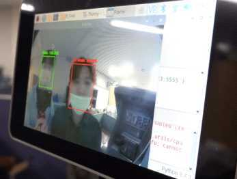
  </a>
  <br />
  <sub>Raspberry Pi A에서 실행 중인 얼굴 탐지·마스크 분류 결과</sub>
</p>

시연에서는 Raspberry Pi A가 카메라 영상을 받아 얼굴과 마스크 상태를 판별하고, Raspberry Pi B가 중계 영상과 미착용 이벤트를 수신했습니다. 분류 결과가 모델 출력에 머물지 않고 화면 표시, 이벤트 전송, 경고음과 발생 정보 출력으로 이어지는 전체 흐름을 확인했습니다.

<a id="validation"></a>
## 🧪 실험과 검증 결과

<p align="center">
  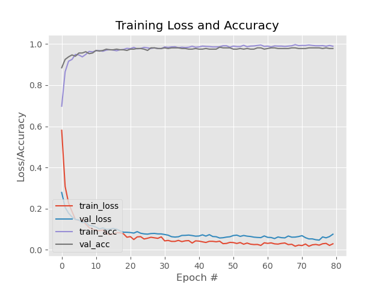
  <br />
  <sub>보존된 80 epoch 학습 로그: 학습·검증 손실 및 정확도 추이</sub>
</p>

학습 곡선은 수렴 과정을 확인하는 자료입니다. 당시 데이터 분할 방식과 별도 테스트셋 조건을 충분히 기록하지 못해, 이 그래프는 학습 과정의 추이를 보여주는 용도로 제시합니다.

| 확인 항목 | 결과와 해석 |
| --- | --- |
| 흰색 마스크 | 데이터를 추가한 뒤 논문 시연 프레임에서 `Mask 99%` 표시 |
| 검은색 마스크 | 검은색 마스크 데이터를 추가한 뒤 시연 프레임에서 `Mask 99%` 표시 |
| 코 노출 착용 | 별도 데이터를 학습한 뒤 시연 프레임에서 `No Mask 99%` 표시 |
| 최종 시연 | 논문은 흰색·검은색 사례의 표시 신뢰도가 모두 91% 이상이라고 기록 |

표의 백분율은 **선별된 시연 프레임에 표시된 모델 신뢰도**입니다. 테스트 표본 수와 데이터 분할, 혼동행렬, 반복 평가를 남기지 못했기 때문에 독립 테스트 정확도와는 구분해야 합니다.

<a id="stack"></a>
## 🧰 기술 구성

| 영역 | 기술 | 사용 목적 |
| --- | --- | --- |
| 언어·학습 | Python, Keras, TensorFlow | CNN 구성·학습, 직렬화 모델 추론 |
| 영상 처리 | OpenCV, Pillow, dlib | 얼굴 탐지, ROI 전처리, 랜드마크 기반 마스크 합성 |
| 데이터·연산 | NumPy, imutils | 배열 변환, 프레임 크기 조정, 배치 입력 구성 |
| 장치 | Raspberry Pi 4, Camera, Display, Speaker | 현장 영상 입력, 추론·모니터링, 경고 출력 |
| 통신 | TCP Socket, imagezmq | 미착용 이벤트와 실시간 영상 분리 전송 |
| 얼굴 탐지 | OpenCV DNN, Caffe SSD | 실시간 프레임의 얼굴 위치 검출 |

<a id="limitations"></a>
## 📌 한계와 배운 점

### 한계

- train/validation/test 분할 기준과 독립 테스트셋 평가를 충분히 남기지 못해 시연 신뢰도를 일반 성능 지표로 사용할 수 없습니다.
- 논문 실험용 CNN에서 최종 실행용 모델로 전환한 과정과 가중치 계보를 명확하게 기록하지 못했습니다.
- LAN IP와 포트가 코드에 고정돼 있고 연결 종료 후 재접속, 상태 점검, 이벤트 중복 제어가 없어 운영 환경에는 추가 보강이 필요합니다.
- 조도, 가림, 사람 수, 카메라 거리 등 실제 환경 변화에 대한 체계적인 강건성 실험이 부족합니다.

### 배운 점과 후속 개선 방향

- 모델 수치만 높이는 것보다 **분류 기준을 데이터로 정확히 표현하는 일**이 중요했습니다. 코 노출 사례를 별도 구성한 이유입니다.
- AI 모델은 단독으로 끝나지 않고 카메라, 네트워크, 알림 장치까지 연결될 때 실제 사용 흐름이 됩니다.
- 다시 구현한다면 데이터 버전과 분할을 고정하고, 모델·가중치·학습 설정을 함께 추적하며, precision·recall·F1과 혼동행렬로 평가하겠습니다.
- 장치 연동은 설정 파일·재연결·헬스 체크·이벤트 쿨다운을 추가해 재현성과 안정성을 높이겠습니다.
