

# IoT 전신주 안전 관리 시스템

**환경·상태 센서 → Raspberry Pi → IBM Watson IoT Platform → Node-RED 관제 화면**

2021년 5인 팀으로 제작한 전신주 안전 관리 시제품입니다. 
센서 수집부터 클라우드 전송과 모니터링까지 연결했고, 과정 프로젝트에서 **팀 우수상**을 받았습니다.

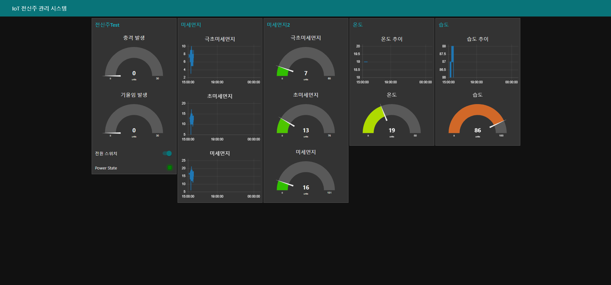

온도·습도·미세먼지와 충격·기울기 상태를 한 화면에서 확인한 Node-RED 대시보드

## 한눈에 보기

| 항목 | 내용 |
|---|---|
| 기간 | 2021.08 · 최종 발표 2021.08.29 |
| 형태 | 5인 팀 최종 프로젝트 |
| 팀 | 박상수 · 김진우 · 김민경 · 사애진 · 신예빈 |
| 담당 업무 | DHT11·PMS7003 센서 데이터 수집 및 Raspberry Pi 연동, IBM Watson IoT 전송, Node-RED 환경 데이터 Flow·모니터링 UI 구성, Fritzing 회로 설계, 하드웨어 통합 테스트, 세부 시나리오 초안 |
| 성과 | 과정 프로젝트 우수상 · 팀 성과 |
| 기술 | Python · Raspberry Pi · DHT11 · PMS7003 · Node-RED · IBM Watson IoT Platform · Fritzing |

## 프로젝트와 문제

전신주 현장 상태를 사람이 매번 확인하지 않아도 온도·습도·미세먼지와 충격·기울기 정보를 원격에서 확인하고, 이상 상황에 대응하는 흐름을 시제품으로 구현했습니다.

목표는 개별 센서의 동작 확인에 그치지 않고 다음 구간을 하나의 흐름으로 연결하는 것이었습니다.

1. Raspberry Pi에서 센서값 수집
2. IBM Watson IoT Platform으로 장치 데이터 전송
3. Node-RED에서 데이터 흐름 구성
4. 대시보드에서 상태 확인
5. 이상 이벤트 발생 시 전원 상태 제어

## 시스템 시나리오

센서 장치가 현장 데이터를 수집하고, IoT 플랫폼이 데이터를 처리·전송하며, 관제 영역에서 상태를 분석하고 대응 명령을 전달하는 구조로 설계했습니다.

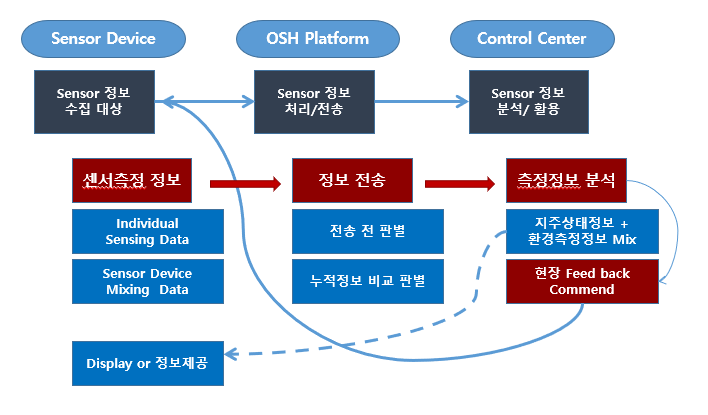

## 통신 구조

Raspberry Pi에 연결한 센서의 데이터를 IBM Watson IoT Platform으로 전달하고, Node-RED에서 데이터 흐름을 구성해 대시보드에 표시했습니다.

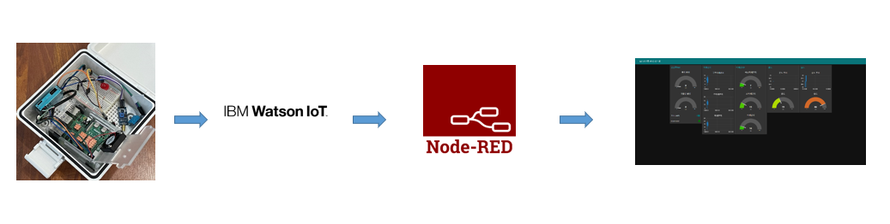

## System FlowChart

센서 수집부터 관제와 전원 제어까지의 전체 흐름은 다음과 같습니다.

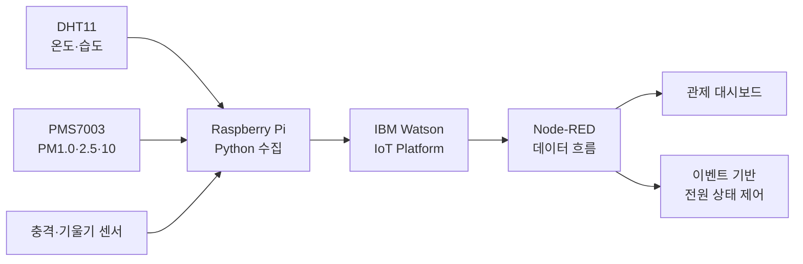

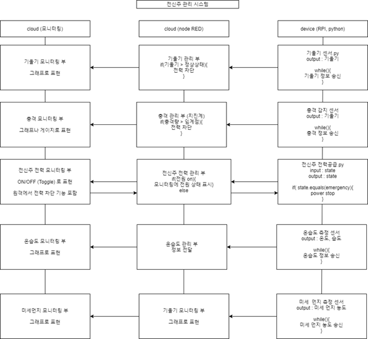

## 센서 모듈

| 센서 | 모델·방식 | 수집 항목 |
|---|---|---|
| 기울기 센서 | SZH-EK084 · GPIO 2 | 기울기 상태 |
| 충격 감지 센서 | KY-002 · GPIO 3 | 충격 상태 |
| 온습도 센서 | DHT11 · GPIO 4 | 온도·습도 |
| 미세먼지 센서 | PMS7003 · UART/Serial | PM1.0·PM2.5·PM10 |

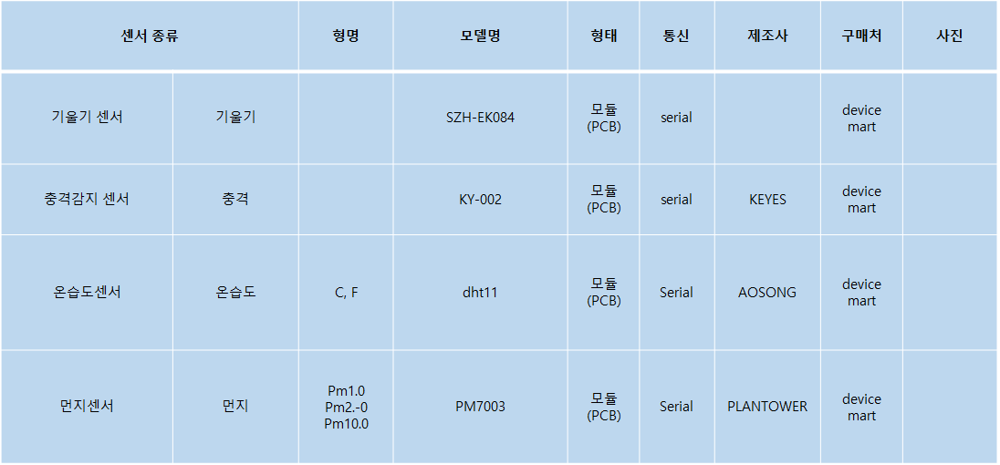

## 구현 내용

### 1. 환경 센서 수집

- DHT11의 온도·습도 값을 Raspberry Pi GPIO에서 읽어 전송 데이터로 구성했습니다.
- PMS7003 직렬 프레임의 헤더·길이·체크섬을 확인하고 PM1.0·PM2.5·PM10 값을 추출했습니다.
- 센서별 데이터를 IBM Watson IoT 이벤트 형식의 JSON으로 구성했습니다.

### 2. 클라우드 전송과 모니터링

- 센서 장치를 IBM Watson IoT Platform에 연결하고 수집값을 주기적으로 전송했습니다.
- Node-RED에서 환경 데이터 흐름과 대시보드 UI를 구성했습니다.
- 센서 연결부터 화면 표시까지 하드웨어와 소프트웨어 구간을 함께 통합 확인했습니다.

### 3. Node-RED Flow

PMS7003과 DHT11은 IBM Watson IoT에서 수신한 값을 Node-RED 함수 노드에서 분리하고, 대시보드의 게이지와 추이 그래프로 전달했습니다.

<table>
  <tr>
    <td>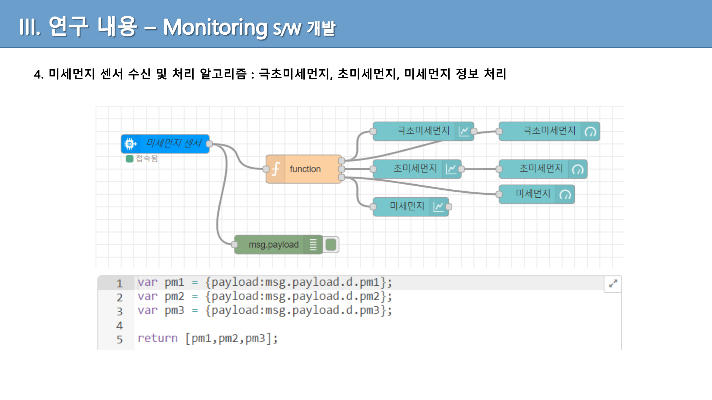</td>
    <td>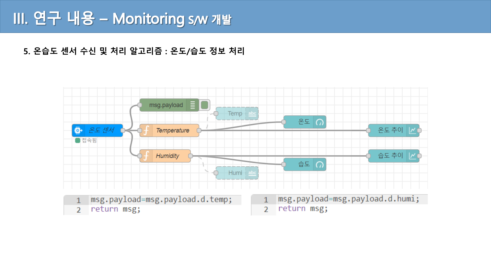</td>
  </tr>
  <tr>
    <td align="center">PMS7003 미세먼지 값 분리·표시</td>
    <td align="center">DHT11 온도·습도 값 분리·표시</td>
  </tr>
</table>

<strong>이벤트 처리·전원 제어 Node-RED Flow 보기</strong>

충격·기울기 이벤트를 판별하고 전원 상태를 제어하는 흐름입니다.

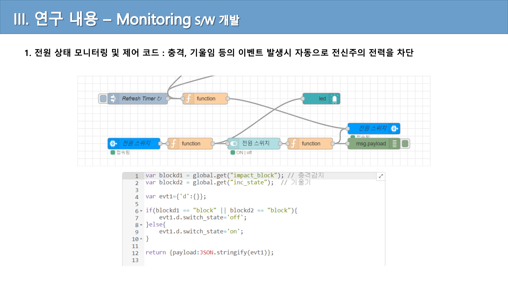

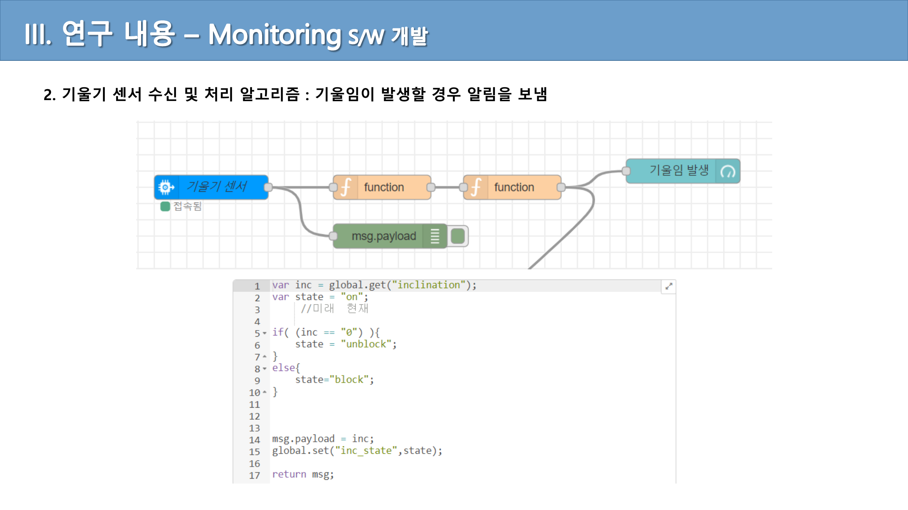

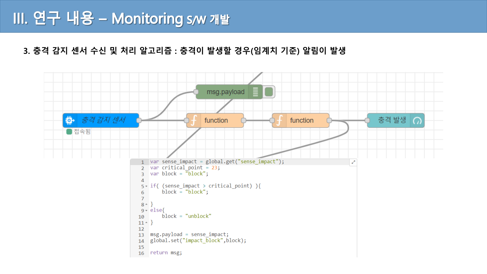

### 4. 회로와 시나리오

- DHT11·PMS7003을 포함한 담당 센서 회로를 Fritzing으로 정리했습니다.
- 감지→전송→관제→대응으로 이어지는 세부 시나리오 초안과 구조·흐름 도식을 작성했습니다.

<table>
  <tr>
    <td>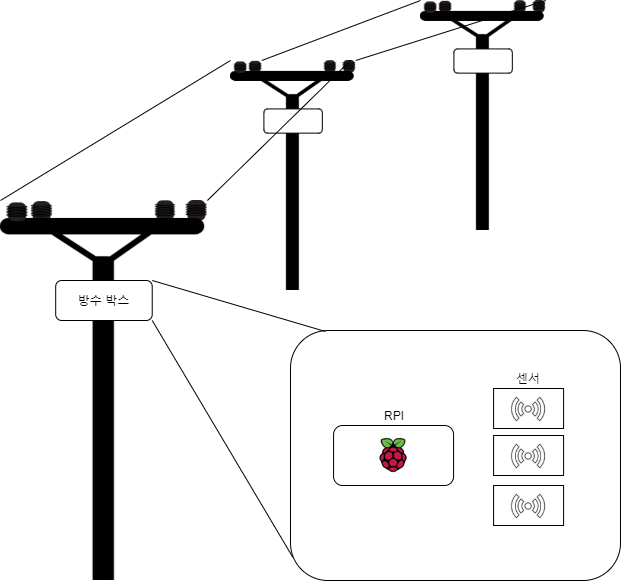</td>
    <td>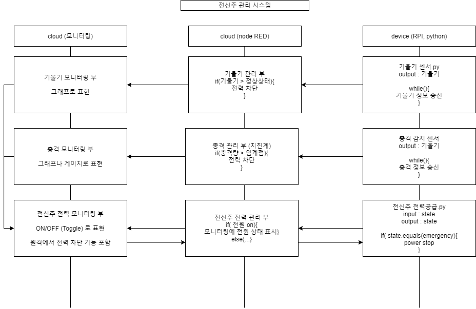</td>
  </tr>
  <tr>
    <td align="center">전신주 시스템 구성도 초안</td>
    <td align="center">센서 감지부터 관제·제어까지의 흐름도 초안</td>
  </tr>
</table>

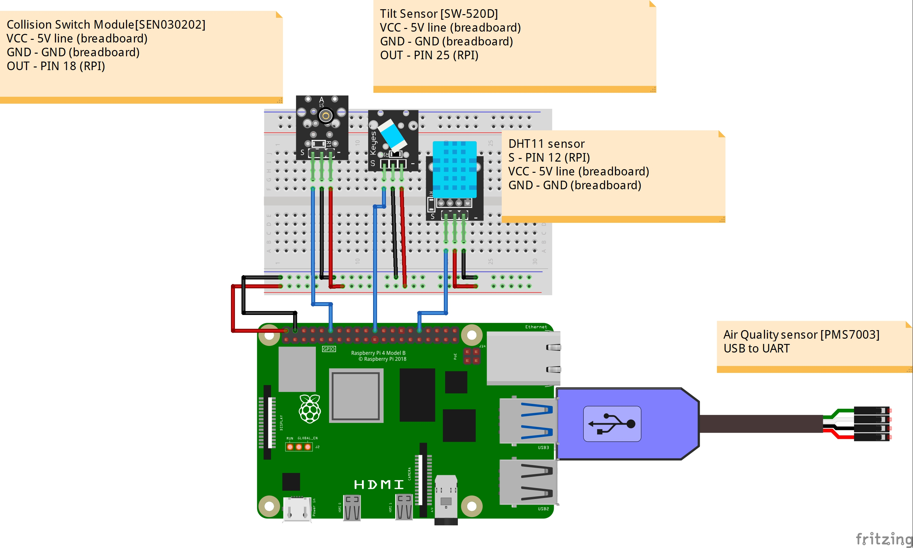

## 모니터링 UI

Node-RED 대시보드에서 충격·기울기, 전원 상태, 온도·습도와 PM1.0·PM2.5·PM10 값을 한 화면에 배치했습니다.

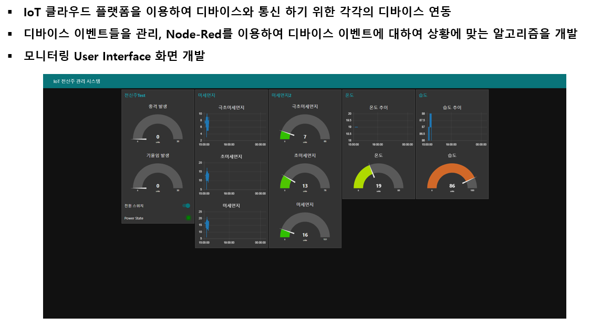

## 데모 시제품

Raspberry Pi와 센서로 회로를 구성하고, 각 센서와 클라우드 플랫폼이 통신할 수 있는 환경을 구축했습니다.

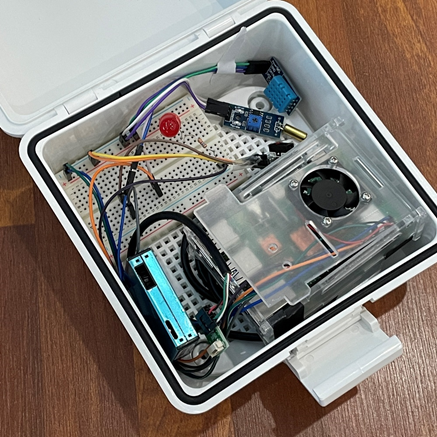

<table>
  <tr>
    <td>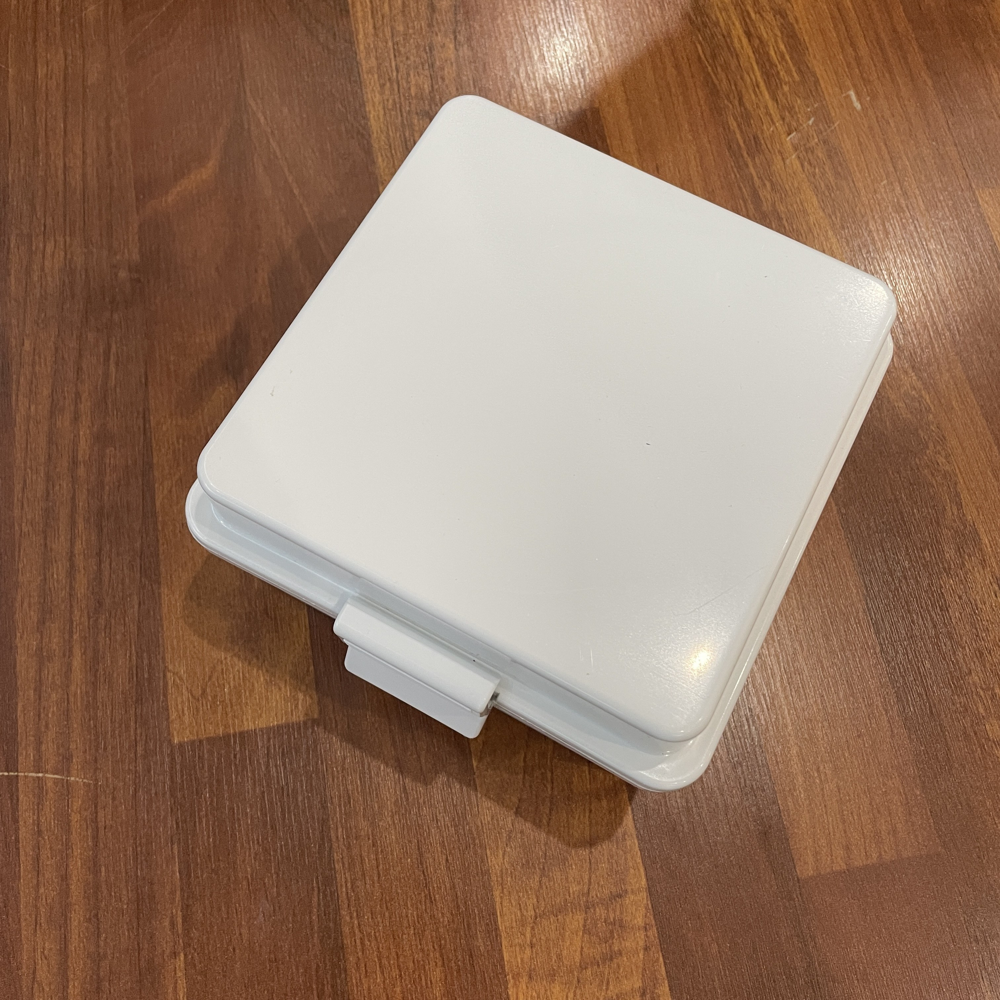</td>
    <td>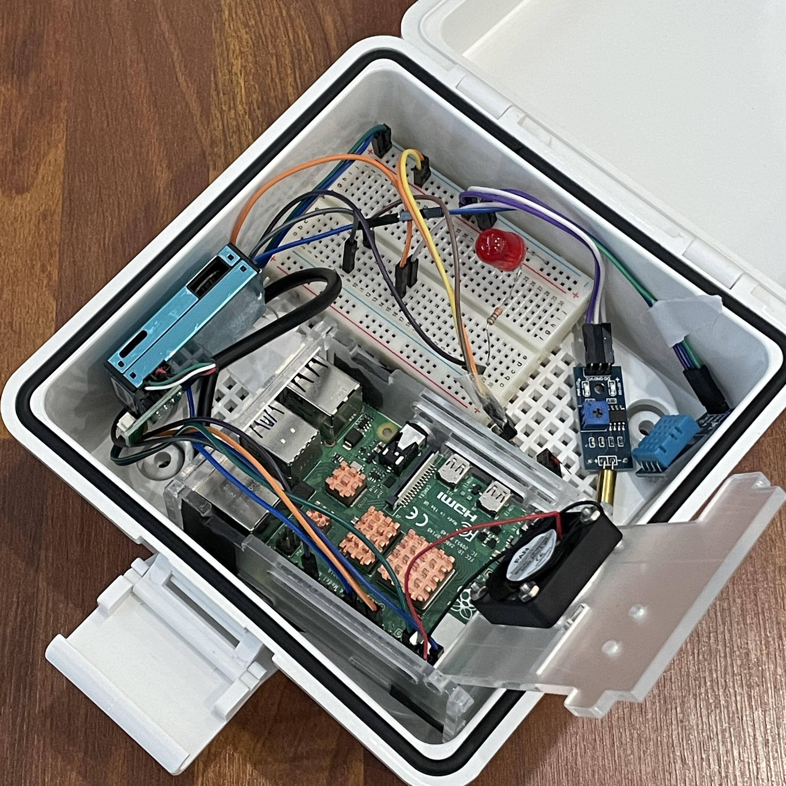</td>
  </tr>
  <tr>
    <td align="center">시제품 외관</td>
    <td align="center">Raspberry Pi와 센서 통합 구성</td>
  </tr>
</table>

## 프로젝트 구현과 결과

5인 팀이 환경 센서와 충격·기울기 감지, 이벤트 기반 전원 제어, IoT 통신 구조와 모니터링 UI를 연결했습니다. 시제품에서 환경·상태 데이터를 대시보드로 확인하는 전체 흐름을 완성했고, 프로젝트 결과로 팀 우수상을 받았습니다.

## 프로젝트 코드

| 코드 | 기능 |
|---|---|
| [`dht11_watson.py`](code/dht11_watson.py) | DHT11 온도·습도 수집·전송 |
| [`pms7003_watson.py`](code/pms7003_watson.py) | PMS7003 프레임 검증·PM 값 추출·전송 |
| [`tilt_sensor_watson.py`](code/tilt_sensor_watson.py) | 기울기 상태 수집·전송 |
| [`impact_sensor_watson.py`](code/impact_sensor_watson.py) | 충격 상태 수집·전송 |
| [`power_control_watson.py`](code/power_control_watson.py) | 클라우드 명령 수신·GPIO 전원 상태 제어 |

## 최종 발표자료

- [33쪽 최종 발표자료 PDF](assets/report/iot-pole-final-presentation-2021.pdf)

17쪽은 PMS7003 미세먼지 데이터 수집·전송 코드, 18쪽은 클라우드 명령에 따른 전원 상태 제어 코드 설명입니다.

## 포트폴리오 코드 안내

`code/`에는 2021년 전신주 최종 프로젝트에서 사용한 Python 코드 5개를 센서와 역할이 드러나도록 정리했습니다.

코드는 당시 IBM Watson IoT와 Raspberry Pi 환경을 기준으로 작성했습니다. PMS7003 관련 제3자 고지는 [`code/THIRD_PARTY_NOTICES.md`](code/THIRD_PARTY_NOTICES.md)에 정리했습니다.
