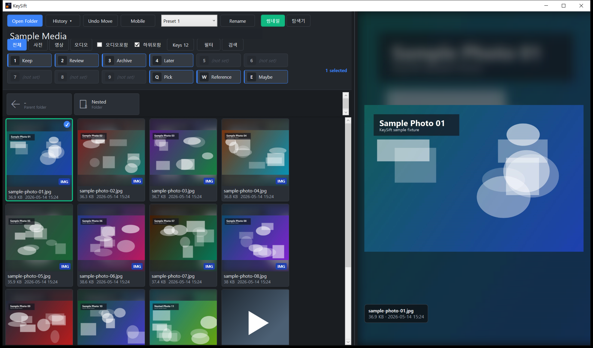
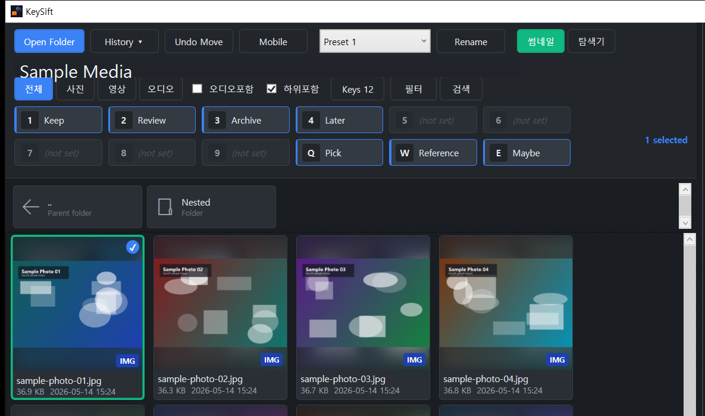
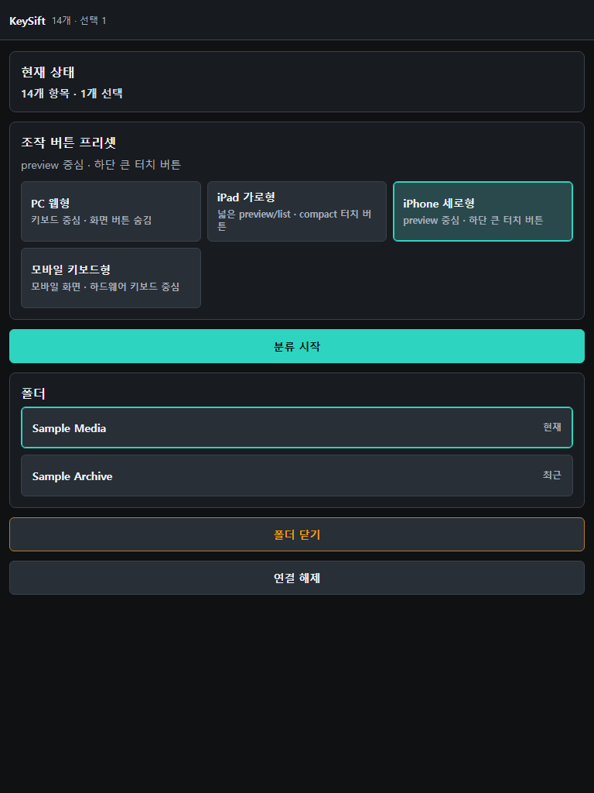

  <h1>🗂️ KeySift</h1>
  <h3>수많은 사진·영상·오디오를, 한 번의 키 입력으로 안전하게 분류</h3>
  
<strong>⚡ 키보드 중심 분류 &nbsp;·&nbsp; 🛡️ 검증 후 안전 이동 &nbsp;·&nbsp; 📱 모바일 LAN 보조</strong>

  

    
    
    
    
  

---

## ✨ KeySift란?

수천 장의 사진·영상·오디오를 하나하나 마우스로 옮기지 마세요. KeySift는 **단축키에 폴더를 미리 매핑**해두면, 키 한 번에 선택한 파일을 해당 폴더로 이동합니다.

기본 `1`~`9`, 옵션으로 `Q,W,E,R,T,Y,U,I,O,P`까지 최대 19개 키를 사용할 수 있습니다. 여러 파일을 함께 선택할 수 있고, 선택 항목이 없으면 현재 미리보기 파일 하나를 이동합니다. 잘못 옮겼다면 `Ctrl+Z`로 최근 작업을 되돌릴 수 있습니다.

## 🎯 누가 쓰면 좋은가

- 휴대폰·카메라에서 가져온 사진을 주제나 보관 기준에 따라 나눌 때
- 촬영 영상과 오디오 클립을 빠르게 훑고 작업 폴더로 분류할 때
- 마우스로 폴더를 반복해서 오가는 대신 키보드 중심으로 정리하고 싶을 때
- Windows 탐색기와 함께 가벼운 선별 도구가 필요할 때

## 🧭 기본 사용 흐름

1. `Open Folder` 또는 `Ctrl+O`로 정리할 폴더를 엽니다.
2. `1`~`9` 키에 목적지 폴더를 지정합니다.
3. 썸네일과 큰 미리보기로 내용을 확인합니다.
4. 파일을 선택하고 매핑한 키를 눌러 이동합니다.
5. 잘못 옮겼다면 `Ctrl+Z`로 최근 이동을 되돌립니다.

## 🚀 주요 기능

### ⚡ 빠른 탐색과 분류

- 기본 9개, 옵션으로 최대 19개의 폴더 단축키
- 여러 파일 선택 후 일괄 이동
- 기본 3개, 최대 10개 프리셋으로 작업별 폴더 매핑 전환

### 🎬 부드러운 미리보기

- `Open Folder`에서 폴더 안 파일 목록을 확인하고, 선택한 파일이 있는 폴더를 바로 열기
- Windows 파일 탐색기의 큰 아이콘 보기와 비슷한 대형 썸네일 그리드
- 사진은 원본 비율로 표시하고, 영상은 선택 후 자동재생
- 영상 반복재생과 미리보기 클릭 또는 `Space` 키 재생·일시정지
- 영상·오디오의 재생 상태, 시간, 위치 이동, 음소거, 미리보기 볼륨을 한 줄에서 조작
- 재생 위치 막대를 드래그하거나 클릭해 원하는 시점부터 바로 재생
- 미리보기 영역의 마우스 휠로 이전·다음 항목 이동
- GIF·WebP 애니메이션과 WebM 영상 미리보기
- 터치 환경에서 좌우 가장자리 탭, 좌우 스와이프, 핀치 확대·축소와 확대 상태 이동
- Windows 기본 썸네일을 만들지 못하는 일부 영상에 FFmpeg 보조 썸네일 사용 가능

### 🔎 탐색·필터

- 사진·영상·오디오 필터, 확장자 다중 필터, 파일명 검색, 하위 폴더 포함
- 이름, 날짜, 유형, 크기, 만든 날짜, 수정한 날짜 기준 정렬과 Windows 파일 탐색기 방식의 이름순
- 폴더를 불러오는 중인 상태, 실제 빈 폴더, 필터 결과가 0개인 상태를 구분
- 탐색기 보기에서 하위 폴더·미디어·일반 파일을 함께 표시하고, 일반 파일은 Windows 기본 프로그램으로 열기
- `..`, `Backspace`, 마우스 뒤로가기·앞으로가기로 폴더 이동
- 하위 폴더를 포함해 보던 파일의 부모·파일 폴더로 이동한 뒤 같은 항목 위치로 복귀
- 항목 우클릭으로 Windows 파일 탐색기에서 위치 확인
- `History`에서 최근 폴더 최대 10개 빠른 전환

### 🌑 다크·터치 UI

- 사진과 영상에 집중할 수 있는 다크 베이스 화면
- 키 영역에서 목적지 폴더의 매핑 여부를 바로 확인
- 현재 항목은 오렌지, 다중 선택은 블루, 현재 항목과 다중 선택이 겹치면 그린으로 구분
- 태블릿에서 선택 모드, 길게 누르기, 쓸어 선택, 선택 개수 표시 지원

### 🛡️ 안전한 파일 작업

- 같은 볼륨에서는 운영체제의 파일 이름 변경 방식으로 이동
- 다른 볼륨에서는 **복사 → 크기 및 SHA-256 검증 → 원본 삭제** 순서로 처리
- 중간 오류나 검증 실패 시 원본을 보존하고 임시 파일 정리
- 파일 작업을 순서대로 처리해 빠른 키 입력이 겹쳐도 충돌을 줄임
- 최근 이동과 같은 앱 실행 중의 휴지통 이동을 `Ctrl+Z`로 복원
- `Delete`는 영구 삭제가 아니라 Windows 휴지통으로 이동

### 📱 모바일 LAN 보조 화면

PC에서 `Mobile`을 켜면 같은 Wi-Fi의 휴대폰·태블릿 브라우저로 현재 미리보기를 확인하고 분류 작업을 보조할 수 있습니다.

- PC 화면에 표시된 주소와 6자리 코드로 연결
- 현재·최근 폴더 전환, 이전·다음, 선택·해제, 매핑 키 이동, Undo
- 휴대폰 세로형, 태블릿 가로형, 키보드 중심 등 화면 구성 선택
- 사용자가 PC에서 기능을 켠 동안만 동작
- 외부 인터넷 공개 터널과 임의 PC 경로 탐색은 기본 제공하지 않음

## ⚙️ 설계 원칙

KeySift는 미디어를 빠르게 넘겨보면서도 실제 파일 이동은 안전해야 한다는 기준으로 동작합니다.

- 큰 폴더에서도 먼저 보이는 항목부터 썸네일을 요청해 초기 대기와 불필요한 작업을 줄였습니다.
- 파일 이동 중에도 다음 판단을 이어갈 수 있도록 화면 전환과 실제 파일 작업을 분리했습니다.
- 다른 드라이브로 옮길 때는 속도보다 데이터 무결성을 우선해 복사본을 검증한 뒤 원본을 삭제합니다.
- 모바일 기능은 별도 클라우드 업로드 없이 같은 LAN에서 사용하도록 설계했으며, 외부 공개 터널은 제공하지 않습니다.
- 핵심 설정·선택·파일 이동·복원 동작은 자동화된 회귀 테스트로 검증합니다.

## 📦 지원 형식

| 종류 | 기본 지원 확장자 |
|---|---|
| 사진 | `.jpg` `.jpeg` `.jfif` `.png` `.gif` `.webp` `.bmp` `.tif` `.heic` `.avif` |
| 영상 | `.mp4` `.m4v` `.mov` `.avi` `.mkv` `.wmv` `.webm` `.mpeg` `.3gp` `.mts` `.m2ts` `.ts` |
| 오디오 | `.mp3` `.flac` `.m4a` `.wav` `.aac` |

실제 재생 가능 여부는 파일 내부 코덱과 Windows 미디어 구성의 영향을 받을 수 있습니다. 오디오 스캔은 기본적으로 꺼져 있으며 설정에서 켤 수 있습니다.

## ⌨️ 핵심 단축키

| 키 | 동작 |
|---|---|
| `1`~`9` | 선택 항목을 연결된 폴더로 이동 |
| `Q W E R T Y U I O P` | 옵션 확장 시 10~19번째 폴더로 이동 |
| `Ctrl+Z` | 최근 이동 되돌리기 |
| `Ctrl+X` / `Ctrl+V` | KeySift 안에서 직접 이동할 항목 잘라내기 / 붙여넣기 |
| `Delete` | Windows 휴지통으로 이동 |
| `Space` | 영상·오디오 재생 또는 일시정지 |
| `←` `→` `↑` `↓` | 항목 이동 |
| `Ctrl+O` | 폴더 열기 |
| `F1` | 홈 화면으로 돌아가기 |
| `Esc` | 선택 해제 |

전체 기능과 문제 해결 방법은 [사용자 매뉴얼](docs/manual.md)에서 확인할 수 있습니다.

## 🧰 기술 스택

| 구분 | 기술 |
|---|---|
| 언어 | C# 12 |
| 데스크톱 UI | WPF |
| 런타임 | .NET 8 |
| 대상 환경 | Windows 10/11 x64 |
| 테스트 | xUnit |
| 현재 버전 | v0.11.1 |

## 💾 설치

현재 공개 배포본은 제공하지 않습니다.

배포본이 제공되면 Windows용 ZIP을 내려받아 압축을 풀고 `KeySift.App.exe`를 실행하는 방식입니다. 일반 배포본은 사용자 설정과 이동 기록을 Windows 사용자 데이터 영역에 저장하며, portable 배포본은 프로그램 폴더와 함께 옮길 수 있도록 별도 로컬 데이터 폴더를 사용합니다.

자세한 첫 실행과 사용 방법은 [사용자 매뉴얼](docs/manual.md)을 참고하세요.

## 🔐 데이터와 네트워크

- 설정, 폴더 매핑, 최근 이동 기록과 썸네일 캐시는 사용자 PC에 로컬로 저장됩니다.
- 앱 사용 분석을 위한 텔레메트리를 수집하지 않습니다.
- 사용자 미디어나 폴더 정보가 외부 서비스로 자동 전송되지 않습니다.
- 모바일 보조 화면은 사용자가 켠 동안 같은 LAN에서 사용하도록 설계했으며, 외부 공개 터널은 제공하지 않습니다.

## 🗓️ 주요 업데이트

모든 수정 내역이 아니라 사용자 흐름을 크게 바꾼 대표 변화를 정리했습니다.

| 버전 | 주요 변화 |
|---|---|
| v0.11.1 | 미리보기 볼륨 조절, Windows 파일 탐색기 방식의 이름 정렬 |
| v0.11.0 | 터치·핀치 조작, 태블릿 선택 모드, FFmpeg 보조 썸네일 |
| v0.9.7 | GIF·WebP 애니메이션과 WebM 미리보기, 미디어 제어 막대 |
| v0.9.3 | 분류 키 최대 19개 확장, 재생 위치 클릭, 미리보기 마우스 휠 이동 |
| v0.9.2 | 하위 폴더와 일반 파일을 함께 보는 탐색기 모드 |

## 📄 라이선스

Copyright (c) 2026 Jinwoo Kim. All rights reserved.

이 저장소의 자료를 열람할 수 있다는 사실은 소스 코드·문서·디자인을 사용, 복제, 수정, 배포, 판매할 권한을 부여하지 않습니다. 자세한 조건은 [LICENSE](LICENSE)를 확인하세요.

---

_Built with WPF and .NET 8. Designed for fast, deliberate, and safe media sorting._
