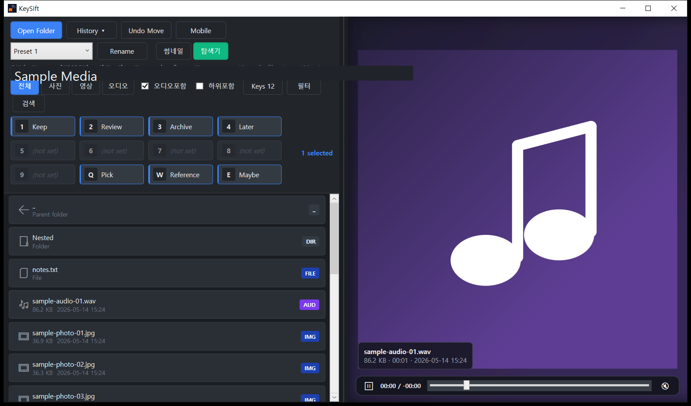
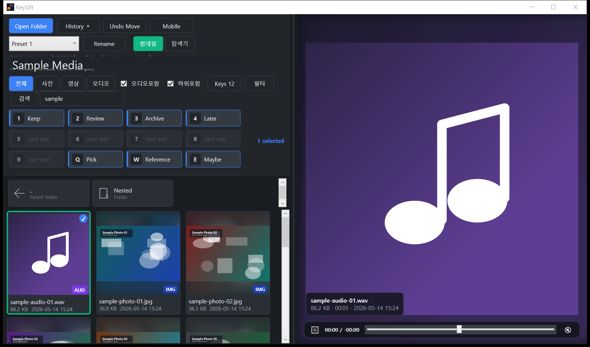

# KeySift 사용자 매뉴얼

KeySift는 Windows에서 사진·영상·오디오를 확인하고, 미리 지정한 폴더로 단축키 한 번에 이동하는 미디어 분류 도구입니다. 본 매뉴얼은 v0.11.1 기준입니다.

> 빠른 시작: 폴더 열기 → 분류 폴더 매핑 → 항목 선택 → 매핑한 키 누르기

## 1. 설치

현재 공개 배포본은 제공하지 않습니다.

배포본이 제공되면 Windows용 ZIP의 압축을 푼 뒤 `KeySift.App.exe`를 실행합니다.

- 일반 배포본: 설정과 이동 기록을 Windows 사용자 데이터 영역에 저장합니다.
- portable 배포본: 프로그램 폴더 안의 별도 데이터 폴더에 설정과 기록을 저장합니다.
- 배포본과 함께 체크섬이 제공되면 실행 전에 다운로드 파일의 무결성을 확인하세요.

Windows SmartScreen이 게시자 정보를 확인하지 못할 수 있습니다. 이 경우 다운로드 출처와 체크섬을 먼저 확인한 뒤 실행 여부를 결정하세요.

지원 환경은 Windows 10/11 x64입니다.

## 2. 첫 실행과 화면 구성

처음 실행하면 홈 화면이 열립니다. 좌측은 폴더 탐색과 썸네일, 우측은 현재 항목의 큰 미리보기입니다. 가운데 구분선을 드래그해 두 영역의 비율을 바꿀 수 있습니다.

KeySift는 사진과 영상에 집중할 수 있는 다크 베이스 화면을 사용합니다. 현재 항목, 다중 선택, 두 상태가 겹친 항목은 서로 다른 테두리 색으로 구분됩니다.

상단의 주요 기능은 다음과 같습니다.

- `Open Folder`: 정리할 폴더 열기
- `History`: 최근 열었던 폴더로 이동
- `Undo Move`: 최근 파일 이동 되돌리기
- `Mobile`: 같은 LAN의 모바일 보조 화면 켜기
- `썸네일` / `탐색기`: 보기 방식 전환
- `Keys N`: 사용할 분류 키 개수 설정
- `필터` / `검색`: 확장자 필터와 파일명 검색

앱을 열 때 이전 작업 폴더가 자동으로 열리지는 않습니다. 홈 화면의 최근 작업 항목이나 `History`에서 이어서 열 수 있습니다.

### 2.1 홈으로 돌아가기

작업 중 `F1`을 누르면 현재 폴더를 닫고 홈 화면으로 돌아갑니다. 홈 화면의 최근 작업 항목에서 직전 폴더를 다시 열거나 다른 폴더를 선택할 수 있습니다.

## 3. 기본 분류 흐름

### 3.1 폴더 열기

`Open Folder`를 누르거나 `Ctrl+O`를 사용해 분류할 폴더를 엽니다. 파일 선택 창에서 파일을 선택하면 그 파일이 들어 있는 폴더가 열립니다.

- 빈 폴더는 파일 이름 칸의 `현재 폴더 열기`를 그대로 두고 열 수 있습니다.
- 큰 폴더는 목록을 준비하는 데 시간이 걸릴 수 있습니다.
- `Open Folder`를 우클릭하면 현재 폴더를 Windows 파일 탐색기로 열 수 있습니다.
- `History`는 최근 작업 폴더를 최대 10개까지 보여줍니다.
- 긴 경로는 화면에서 줄여 표시되며, 마우스를 올리면 전체 경로를 확인할 수 있습니다.

### 3.2 썸네일 보기와 탐색기 보기

`썸네일` 보기는 미디어를 빠르게 확인하고 분류하는 기본 화면입니다. `탐색기` 보기는 하위 폴더, 미디어 파일, 일반 파일을 세로 목록으로 함께 보여줍니다.

탐색기 보기에서는 다음 동작을 사용할 수 있습니다.

- 폴더 더블클릭: 해당 폴더로 이동
- `..` 더블클릭 또는 `Backspace`: 부모 폴더로 이동
- 마우스 뒤로가기·앞으로가기 버튼: 폴더 탐색 기록 이동
- 미디어 파일 클릭: 우측 미리보기로 확인
- 일반 파일 더블클릭: Windows 기본 프로그램으로 열기
- 항목 우클릭: Windows 파일 탐색기에서 위치 확인
- 하위 폴더 포함 상태의 항목 우클릭: 부모 폴더 보기 또는 파일 폴더 보기로 전환하고 같은 항목 위치로 이동

부모·하위 폴더 줄 표시는 하위 폴더 포함 옵션과 별도로 켤 수 있습니다. 폴더 보기에서 다른 위치로 이동했다가 돌아오면 가능하면 이전에 보던 항목 위치를 이어서 보여줍니다.

### 3.3 분류 키 매핑

상단 키 영역에서 각 키에 목적지 폴더를 연결합니다. 비어 있는 키는 `(not set)`으로 표시됩니다.

- 기본 키: `1`~`9`
- 확장 키: `Q W E R T Y U I O P`
- `Keys N`에서 1~19개 사이로 조정
- 프리셋: 기본 3개, 최대 10개. 각 프리셋은 독립적인 키 매핑을 가짐

키 영역을 우클릭하면 매핑을 지우거나 목적지 폴더를 Windows 파일 탐색기로 열 수 있습니다.

설정 창에서는 기본 보기, 하위 폴더 포함, 오디오 포함, 기본 음소거, 영상 자동재생, 키 개수, 프리셋을 관리할 수 있습니다. 프리셋을 내보낸 JSON에는 목적지 폴더 경로가 포함될 수 있으므로 개인 설정 파일로 취급하세요.

### 3.4 항목 선택

- 단일 선택: 썸네일 클릭 또는 화살표 키
- 여러 항목 선택: `Ctrl+클릭`
- 범위 선택: `Shift+클릭`
- 선택 해제: `Esc`

선택 상태는 다음 테두리 색으로 구분됩니다.

- 현재 항목: 오렌지
- 다중 선택: 블루
- 현재 항목이면서 다중 선택됨: 그린

터치 가능한 Windows 기기에서는 상단 `선택` 버튼이나 항목을 길게 눌러 선택 모드를 시작할 수 있습니다. 항목을 쓸어 여러 개를 선택하고, 화면의 선택 개수 표시에서 현재 선택 수를 확인할 수 있습니다.

### 3.5 단축키로 이동

항목을 선택하고 목적지 폴더에 연결한 키를 누르면 파일이 이동합니다. 여러 항목이 선택되어 있으면 함께 이동하고, 선택 항목이 없으면 현재 미리보기 항목 하나를 이동합니다.

- 같은 볼륨: 운영체제의 파일 이름 변경 방식으로 이동
- 다른 볼륨: 임시 복사 → 크기와 SHA-256 검증 → 최종 이름 적용 → 원본 삭제

다른 볼륨의 큰 영상은 검증 때문에 시간이 더 걸릴 수 있습니다. 화면에서는 다음 항목을 계속 확인할 수 있고, 실제 파일 작업은 입력 순서대로 처리됩니다.

### 3.6 되돌리기와 휴지통

`Ctrl+Z` 또는 `Undo Move`로 최근 이동을 되돌릴 수 있습니다.

- 이동 기록은 폴더별로 구분됩니다.
- 최근 이동 기록은 앱을 다시 실행한 뒤에도 일부 유지됩니다.
- `Delete`는 파일을 영구 삭제하지 않고 Windows 휴지통으로 보냅니다.
- 같은 앱 실행 중 최근 휴지통 이동은 `Ctrl+Z`로 복원할 수 있습니다.
- 휴지통을 비웠거나 원래 위치에 같은 이름의 파일이 있으면 복원이 실패할 수 있습니다.

### 3.7 매핑하지 않은 폴더로 이동

다음 두 방법을 사용할 수 있습니다.

- 항목 우클릭 → `이동하기...` → 목적지 폴더 선택
- 항목 선택 → `Ctrl+X` → 탐색기 보기에서 목적지 폴더 이동 → `Ctrl+V`

이 잘라내기·붙여넣기는 Windows 전역 클립보드가 아니라 KeySift 안의 이동 대기 상태를 사용하며, 성공한 이동은 Undo 대상에 포함됩니다.

## 4. 미리보기

우측 미리보기는 현재 포커스 항목을 크게 보여줍니다.

### 4.1 사진

사진은 원본 비율을 유지하면서 영역 안에 맞춰 표시됩니다. 여러 프레임을 지원하는 환경에서는 GIF와 WebP가 반복 재생될 수 있으며, 탐색 목록의 썸네일은 빠른 스크롤을 위해 정지 이미지로 보입니다.

### 4.2 영상과 오디오

- 영상 선택 후 자동재생과 반복재생
- `Space` 또는 미리보기 클릭: 재생·일시정지
- 하단 막대: 재생 상태, 현재·남은 시간, 위치 이동, 음소거, 미리보기 볼륨 조절
- 재생 위치 막대 드래그 또는 클릭: 원하는 시점으로 이동한 뒤 재생
- 미리보기 위 마우스 휠: 이전·다음 항목 이동
- `Ctrl`+마우스 휠 또는 `Ctrl`+`+` / `Ctrl`+`-`: 임시 확대·축소
- 확대 상태에서 `Ctrl`+드래그: 표시 위치 이동
- 터치 환경에서 좌우 가장자리 탭 또는 좌우 스와이프: 이전·다음 항목 이동
- 터치 환경에서 핀치와 드래그: 확대·축소와 확대 상태 위치 이동

영상은 선택 직후 짧은 지연을 두고 재생합니다. 연속 분류 중 재생 준비가 파일 이동을 방해하지 않도록, 이동 직후에는 자동재생을 잠시 억제합니다.

오디오는 기본적으로 목록에서 제외됩니다. 설정에서 오디오 포함을 켜면 지원 형식이 `AUD` 배지와 함께 표시됩니다.

Windows가 기본 썸네일을 만들지 못하는 일부 영상은 설정에서 사용자가 지정한 FFmpeg 실행 파일로 보조 썸네일을 만들 수 있습니다.

## 5. 필터·검색·정렬

- 미디어 필터: 전체, 사진, 영상, 오디오
- 확장자 필터: 현재 폴더에서 발견된 여러 확장자를 함께 선택
- 검색: 파일명 일부를 입력해 현재 목록 좁히기
- 하위 폴더 포함: 현재 폴더 아래의 미디어를 한 목록에 표시
- 정렬: 이름, 날짜, 유형, 크기, 만든 날짜, 수정한 날짜와 방향 선택. 이름순은 Windows 파일 탐색기처럼 숫자 덩어리를 자연스럽게 비교

검색창에 포커스가 있으면 숫자와 문자는 분류 키가 아니라 검색어로 입력됩니다. `Enter`는 목록으로 포커스를 돌리고, `Esc`는 검색을 닫습니다.

탐색 영역에서 `Ctrl`+마우스 휠을 사용하면 현재 실행 중에만 썸네일 크기를 조절할 수 있습니다.

폴더를 불러오는 중인 상태, 실제 빈 폴더, 필터나 검색 결과가 0개인 상태는 서로 다른 안내로 구분됩니다.

썸네일 오른쪽 위 배지는 미디어 종류를 표시합니다.

- `IMG`: 사진
- `VID`: 영상
- `AUD`: 오디오

## 6. 프리셋

프리셋은 서로 다른 목적지 폴더 매핑을 빠르게 전환하는 기능입니다. 예를 들어 1차 선별과 보관용 분류를 서로 다른 프리셋으로 나눌 수 있습니다.

기본 프리셋 수는 3개이며 설정에서 최대 10개까지 사용할 수 있습니다. 각 프리셋은 이름과 키별 목적지 폴더를 독립적으로 저장합니다.

- 프리셋 이름 변경
- 프리셋별 키 매핑 저장
- 키별 목적지 순서 드래그 재배치
- 선택 프리셋 또는 전체 프리셋을 JSON으로 내보내기

프리셋 개수를 줄이면 초과 프리셋이 삭제될 수 있으므로 확인 창의 내용을 확인하세요.

## 7. 모바일 LAN 보조 화면

PC 앱에서 `Mobile`을 켜면 같은 Wi-Fi의 휴대폰이나 태블릿 브라우저에서 보조 화면을 사용할 수 있습니다.

### 연결

1. PC 앱에서 `Mobile`을 켭니다.
2. PC 화면의 QR 코드 또는 로컬 주소를 휴대폰에서 엽니다.
3. PC 화면에 표시된 6자리 코드를 입력합니다.

PC의 `Open Default Browser`는 Windows 기본 브라우저로 연결 주소를 열고 접속 코드를 클립보드에 복사합니다. 다른 브라우저나 프로필을 사용하려면 `Copy Link` 또는 `Copy QR Link`로 주소를 복사해 원하는 브라우저에 붙여넣으세요.

### 할 수 있는 일

- 현재 상태와 항목 수 확인
- 현재 폴더와 최근 폴더 전환
- 이전·다음 항목 이동과 선택·해제
- 매핑한 `1`~`9`, `Q`~`P` 키로 이동
- Undo
- 영상·오디오 미리보기
- 휴대폰 세로형, 태블릿 가로형, 키보드 중심 등 조작 화면 선택

모바일 기능은 PC 앱에서 켠 동안만 동작합니다. 외부 인터넷 공개 터널과 임의 PC 경로 탐색은 기본 제공하지 않으며, 모바일 화면에서는 파일 삭제를 제공하지 않습니다.

같은 Wi-Fi에서 연결되지 않으면 Windows 방화벽과 네트워크 프로필을 확인하세요. KeySift는 TCP `39240-39320` 범위에서 사용 가능한 포트를 선택합니다. 방화벽을 허용할 때는 가능하면 KeySift 실행 파일, 로컬 서브넷, 이 포트 범위로 제한하세요.

## 8. 지원 미디어

| 종류 | 기본 지원 확장자 |
|---|---|
| 사진 | `.jpg` `.jpeg` `.jfif` `.png` `.gif` `.webp` `.bmp` `.tif` `.heic` `.avif` |
| 영상 | `.mp4` `.m4v` `.mov` `.avi` `.mkv` `.wmv` `.webm` `.mpeg` `.3gp` `.mts` `.m2ts` `.ts` |
| 오디오 | `.mp3` `.flac` `.m4a` `.wav` `.aac` |

같은 확장자라도 내부 코덱과 Windows 미디어 구성에 따라 미리보기 결과가 달라질 수 있습니다. RAW 사진은 현재 기본 지원 목록에 포함되지 않습니다.

## 9. 단축키

| 키 | 동작 |
|---|---|
| `1`~`9` | 선택 항목을 연결된 폴더로 이동 |
| `Q W E R T Y U I O P` | 옵션 확장 시 10~19번째 폴더로 이동 |
| `Ctrl+Z` | 최근 이동 또는 같은 실행 중의 최근 휴지통 이동 복원 |
| `Ctrl+X` | 선택 미디어를 KeySift 이동 대기 상태로 만들기 |
| `Ctrl+V` | 현재 폴더로 이동 대기 항목 붙여넣기 |
| `Delete` | Windows 휴지통으로 이동 |
| `Space` | 영상·오디오 재생 또는 일시정지 |
| `←` `→` | 이전·다음 항목 |
| `↑` `↓` | 윗줄·아랫줄 항목 |
| `Ctrl+O` | 폴더 열기 |
| `F1` | 홈 화면으로 돌아가기 |
| `Esc` | 선택 해제 |
| `Backspace` | 부모 폴더로 이동 |
| 미리보기 위 마우스 휠 | 이전·다음 항목 |
| 탐색 영역에서 `Ctrl`+마우스 휠 | 썸네일 크기 조절 |
| 미리보기에서 `Ctrl`+마우스 휠 | 현재 미디어 확대·축소 |
| 확대된 미리보기에서 `Ctrl`+드래그 | 표시 위치 이동 |

## 10. 사용자 데이터와 개인정보

### 일반 모드

설정과 이동 기록은 `%LOCALAPPDATA%\KeySift\` 아래에 저장됩니다.

- `settings.json`: 프리셋, 키 매핑, 창 크기, 옵션
- `move-history.json`: 최근 Undo 기록
- `thumbnail-cache\`: 다시 보는 미디어의 썸네일을 빠르게 표시하기 위한 로컬 캐시

썸네일 캐시에는 미디어 내용을 축소한 이미지가 들어갈 수 있으므로 개인 데이터로 취급하세요. 캐시는 삭제해도 필요한 항목이 다시 생성됩니다.

설정을 백업하려면 `settings.json`을 보관하세요. 최근 Undo 기록도 함께 보관하려면 `move-history.json`을 추가로 백업합니다. 썸네일 캐시는 다시 만들 수 있으므로 필수 백업 대상이 아닙니다.

### Portable 모드

portable 배포본은 프로그램 폴더의 `KeySift.UserData\` 아래에 설정과 기록을 둡니다. 프로그램을 이동하거나 삭제할 때 이 폴더에 개인 경로와 썸네일이 남을 수 있음을 확인하세요.

### 네트워크와 전송

- 사용 분석 텔레메트리를 수집하지 않습니다.
- 사용자 미디어나 폴더 정보가 외부 서비스로 자동 전송되지 않습니다.
- 모바일 보조 화면은 사용자가 켠 동안 같은 LAN에서 사용하도록 설계했으며, 외부 공개 터널은 제공하지 않습니다.

## 11. 안전 정책

### 파일 이동

다른 볼륨으로 이동할 때는 다음 순서를 따릅니다.

1. 목적지에 임시 파일로 복사
2. 원본과 복사본의 크기 비교
3. SHA-256 해시 비교
4. 임시 파일을 최종 이름으로 변경
5. 원본 삭제

검증 실패나 중간 오류가 발생하면 임시 파일을 정리하고 원본을 보존합니다.

### 연속 입력

분류 키를 빠르게 연속 입력해도 파일 작업은 순서대로 처리됩니다. 처리 중인 항목을 Undo 대상으로 잘못 복원하지 않으며, 성공한 복원만 목록에 다시 표시합니다.

### 사용 전 권장 사항

- 중요한 원본은 별도 백업을 유지하세요.
- 처음 사용할 때는 복사본이 있는 작은 폴더로 이동과 Undo를 확인하세요.
- 다른 드라이브나 네트워크 드라이브에서는 검증 시간이 길어질 수 있습니다.
- portable 폴더를 공유하기 전에 로컬 데이터 폴더가 포함되지 않았는지 확인하세요.

## 12. 문제 해결

### 영상이 재생되지 않거나 검은 화면이다

- 같은 파일이 Windows 기본 미디어 플레이어에서 재생되는지 확인합니다.
- 설정에서 영상 자동재생이 켜져 있는지 확인합니다.
- 파일의 컨테이너는 지원 목록에 있어도 내부 코덱이 Windows에서 지원되지 않을 수 있습니다.
- 특정 MP4가 Windows 기본 플레이어에서도 늦게 시작된다면 파일 내부 시간 정보나 키프레임 구조의 영향일 수 있습니다. 원본을 보존한 복사본으로 재인코딩 또는 정규화를 검토하세요.

### 폴더가 열리지 않는다

- Windows 파일 탐색기에서 해당 폴더에 일반 사용자 권한으로 접근되는지 확인합니다.
- 네트워크 드라이브라면 연결 상태를 확인합니다.
- 다른 일반 폴더를 열어 폴더 자체 문제인지 구분합니다.

### 썸네일이 회색으로 남는다

- 잠시 기다린 뒤 다시 확인합니다.
- 폴더를 닫았다가 다시 엽니다.
- 해당 파일이 다른 뷰어에서 정상적으로 열리는지 확인합니다.
- 일부 영상은 Windows 썸네일을 만들지 못할 수 있으며, 설정한 FFmpeg로 보조 썸네일을 사용할 수 있습니다.

### 분류 키가 동작하지 않는다

- 검색창이나 텍스트 입력 칸에 포커스가 있는지 확인합니다.
- 해당 키에 목적지 폴더가 연결되어 있는지 확인합니다.
- 썸네일을 클릭해 현재 항목이 있는지 확인합니다.

### 다른 볼륨 이동이 느리다

복사 뒤 크기와 SHA-256을 검증하기 때문입니다. 큰 영상이나 네트워크 드라이브에서는 시간이 길어질 수 있으며, 데이터 무결성을 위한 의도된 동작입니다.

### 모바일 화면에 연결되지 않는다

- PC와 모바일 기기가 같은 Wi-Fi 또는 LAN에 있는지 확인합니다.
- PC 앱에서 모바일 기능이 켜져 있는지 확인합니다.
- 6자리 연결 코드를 다시 확인합니다.
- Windows 방화벽과 네트워크 프로필에서 KeySift의 로컬 통신이 허용되는지 확인합니다.

### 재생 위치 막대가 움직이지 않는다

- 영상이나 오디오가 실제로 재생 중인지 확인합니다.
- 일부 파일은 Windows가 전체 재생 시간을 읽지 못해 위치 이동이 제한될 수 있습니다.
- 같은 형식의 다른 파일로 확인해 파일·코덱 문제인지 구분합니다.

### 앱이 갑자기 느려진다

큰 폴더 스캔, 영상 자동재생, 빠른 분류 입력이 동시에 겹치면 일시적으로 느려질 수 있습니다. 잠시 기다리거나 폴더를 다시 열어 확인하고, 같은 파일 조합에서 반복되면 폴더 규모와 미디어 종류를 함께 기록해 문제를 구분하세요.

## 13. 라이선스와 지원

KeySift는 **All Rights Reserved** 조건입니다. 포트폴리오 열람을 위해 자료가 공개되어도 사용·복제·수정·배포·판매 권한이 자동으로 부여되지는 않습니다. 자세한 내용은 [LICENSE](../LICENSE)를 확인하세요.
