<div align="center">
  <h1>📈 QInvest</h1>
  <h3>흩어진 미국 시장 데이터를,<br />매일 복기할 수 있는 하나의 흐름으로</h3>
  <p><strong>📊 시장 데이터 수집·분석 &nbsp;·&nbsp; 🔎 관심 종목 리포트 &nbsp;·&nbsp; 💬 멀티채널 알림</strong></p>
</div>

---

QInvest는 여러 출처에 흩어진 시장 지표와 옵션 데이터를 사용자가 매번 찾아 조합해야 하는 불편에서 시작했습니다. 사용자는 관심 종목을 등록하고 종목별 데이터 분석과 미국 시장 브리핑을 한 흐름에서 확인하며, 연결한 메신저로 리포트 알림을 받을 수 있습니다.

웹·API·데이터 수집·분석부터 회원·구독·결제와 관리 도구까지 하나의 제품 흐름으로 구현했습니다.

| 구분 | 내용 |
|---|---|
| 기간 | 2026.02 ~ 현재 |
| 역할 | 개발 구현 담당 |
| 서비스 채널 | Web · KakaoTalk · Telegram |
| 현재 단계 | 핵심 기능 구현 · 공개 출시 전 민감정보 보호와 데이터 이관·복구 조건 검증 중 |

<a id="contents"></a>

## 🧭 목차

- [🎯 제품 흐름](#product-flow)
- [🧩 구현 범위](#implementation-scope)
- [🔑 핵심 기술 포인트](#technical-highlights)
- [✨ 대표 기능](#features)
- [🖼️ 화면으로 보는 제품](#screens)
- [🏗️ 시스템·데이터 구성](#architecture)
- [🧠 핵심 기술 의사결정](#decisions)
- [🛡️ 백업·복구 설계](#backup-recovery)
- [🧪 개발·검증 방식](#development-validation)
- [🧰 기술 구성과 현재 상태](#technology)

<a id="product-flow"></a>

## 🎯 제품 흐름

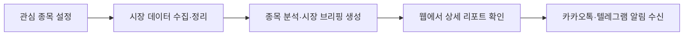
```mermaid
flowchart LR
    A[관심 종목 설정] --> B[시장 데이터 수집·정리]
    B --> C[종목 분석·시장 브리핑 생성]
    C --> D[웹에서 상세 리포트 확인]
    D --> E[카카오톡·텔레그램 알림 수신]
```

웹은 계정·결제·관심 종목과 상세 리포트를 관리하는 중심 화면입니다. 카카오톡과 텔레그램은 로그인과 리포트 수신 채널로 연결됩니다. 관심 종목을 고른 뒤 수집, 분석, 저장, 화면 제공과 알림까지 같은 회원 기준으로 이어지도록 구성했습니다.

<a id="implementation-scope"></a>

## 🧩 구현 범위

| 영역 | 주요 구현 |
|---|---|
| 사용자 웹 | 홈, 대시보드, 관심 종목, 종목 분석, 시장 브리핑, 회원·구독·결제 화면 |
| 서버 API | 회원 통합, 인증, 관심 종목, 결제·환불, 분석 데이터와 관리자 API |
| 데이터·분석 | 시장 데이터 수집·정규화, 분석 이력 저장, 예약 작업과 리포트 연결 |
| 채널 연동 | 웹·카카오톡·텔레그램 계정 연결과 알림 흐름 |
| 운영 도구 | 사용자·문의·알림·공지·분석 작업 관리 화면 |
| 데이터 안정성 | DB migration, 온라인 스냅샷, 무결성 검사와 격리 복구 도구 |

<a id="technical-highlights"></a>

## 🔑 핵심 기술 포인트

| 포인트 | 구현 방향 |
|---|---|
| 🔗 멀티채널 회원 통합 | 웹·카카오톡·텔레그램의 연결 정보는 분리하되 구독·결제·관심 종목은 하나의 회원 ID를 기준으로 관리 |
| 🔁 재실행 안전성 | 결제 요청과 분석 작업이 반복되거나 일부만 실패해도 중복 처리와 상태 불일치가 발생하지 않도록 설계 |
| 🛡️ 복구 가능한 데이터 경계 | 성격이 다른 두 SQLite DB를 일관된 단위로 스냅샷하고 격리된 대상에서 복원·재검증 |

<a id="features"></a>

## ✨ 대표 기능

### 관심 종목과 알림

- 결제 기간 단위로 미국 주식 관심 종목 추가·삭제
- 관심 종목에서 종목 분석 화면으로 바로 이동
- 종목별 주요 가격 알림 수신 여부 관리
- 같은 요청이 반복돼도 상태가 중복 변경되지 않도록 멱등 처리

### 종목별 데이터 분석

- 관심 종목과 이용 권한을 확인한 뒤 분석 리포트 제공
- 가격 흐름, 옵션 레벨·노출, 순옵션 프리미엄과 해설을 한 화면에 구성
- 현재가와 분석 기준일을 분리하고 날짜별 과거 분석 조회 지원
- 조건을 충족한 옵션 강세 후보만 제공하고, 결과가 없을 때 낮은 점수 후보로 임의 보충하지 않음

### 미국 시장 브리핑

- 주요 지수, 금리, 환율과 경제지표 요약
- 다음 경제 일정과 주요 헤드라인 정리
- 시장 핵심 요약과 섹터 히트맵 제공
- 날짜별 과거 브리핑 조회

### 멀티채널 회원·구독·결제

- 웹·카카오톡·텔레그램 계정을 하나의 회원 기준으로 연결
- 구독 상태, 결제 내역, 업그레이드·다운그레이드·해지·재개 관리
- 관심 종목, 추천인과 리워드 흐름을 회원 ID 중심으로 통합

### 운영자 기능

- 사용자·고객 문의·알림센터·공지 전송 관리
- 분석 작업과 서비스 상태를 확인하는 관리 화면
- 홈 미리보기, AI 라우팅과 콘텐츠 검토 도구 연결

<a id="screens"></a>

## 🖼️ 화면으로 보는 제품

아래 이미지는 현재 구현된 화면 흐름과 기능 구성을 바탕으로 재구성한 공개용 합성 화면입니다. 실제 계정·결제·투자 데이터와 외부 서비스 연결을 사용하지 않았으며, 표시된 수치와 이름은 모두 예시입니다.

### 홈

<a href="./assets/home-desktop-dummy.png">
  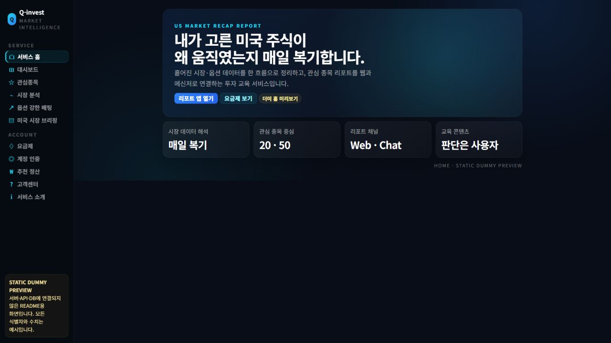
</a>

서비스의 목적과 핵심 기능을 소개하고 대시보드, 시장 분석과 요금제로 연결하는 시작 화면입니다.

### 대시보드

<a href="./assets/dashboard-desktop-dummy.jpg">
  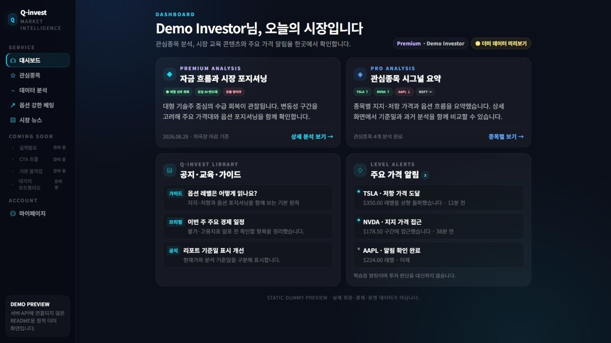
</a>

주요 시장 지표와 관심 종목의 상태를 한눈에 확인하고 상세 분석으로 이동하는 중심 화면입니다.

### 시장 분석

<a href="./assets/market-analysis-desktop-dummy.png">
  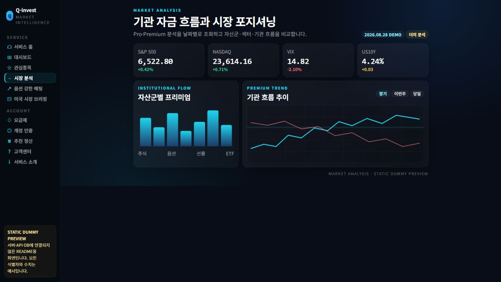
</a>

자산군별 자금 흐름과 시장 포지셔닝을 날짜별로 비교하며 시장의 맥락을 복기하는 화면입니다.

### 핵심 이용 화면

<table>
  <tr>
    <th width="50%">관심 종목</th>
    <th width="50%">옵션 강세 후보</th>
  </tr>
  <tr>
    <td><a href="./assets/watchlist-desktop-dummy.jpg">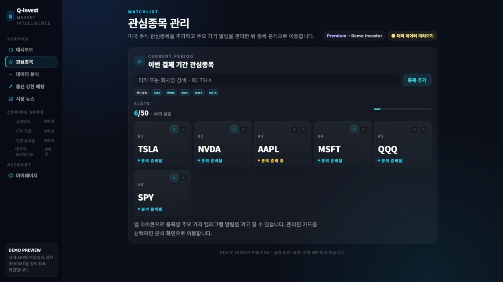</a></td>
    <td><a href="./assets/options-betting-desktop-dummy.png">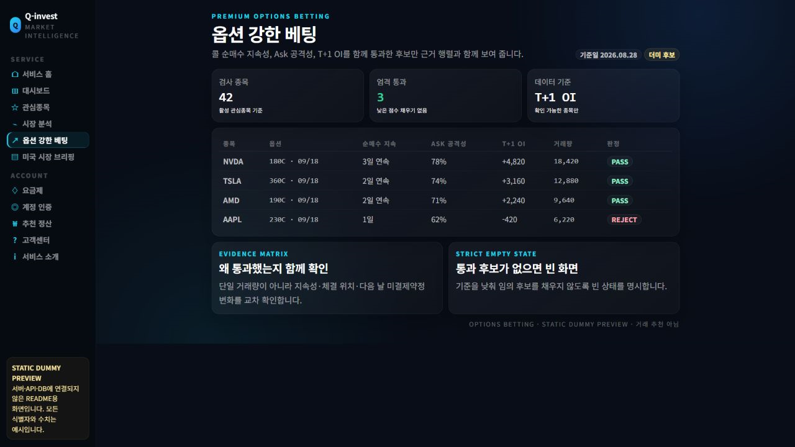</a></td>
  </tr>
  <tr>
    <td>분석할 종목을 등록하고 알림 수신 여부와 이용 기간을 관리합니다.</td>
    <td>정해진 분석 조건을 통과한 옵션 강세 후보와 판단 근거를 확인합니다.</td>
  </tr>
  <tr>
    <th>회원·구독 관리</th>
    <th>가격제</th>
  </tr>
  <tr>
    <td><a href="./assets/account-desktop-dummy.jpg">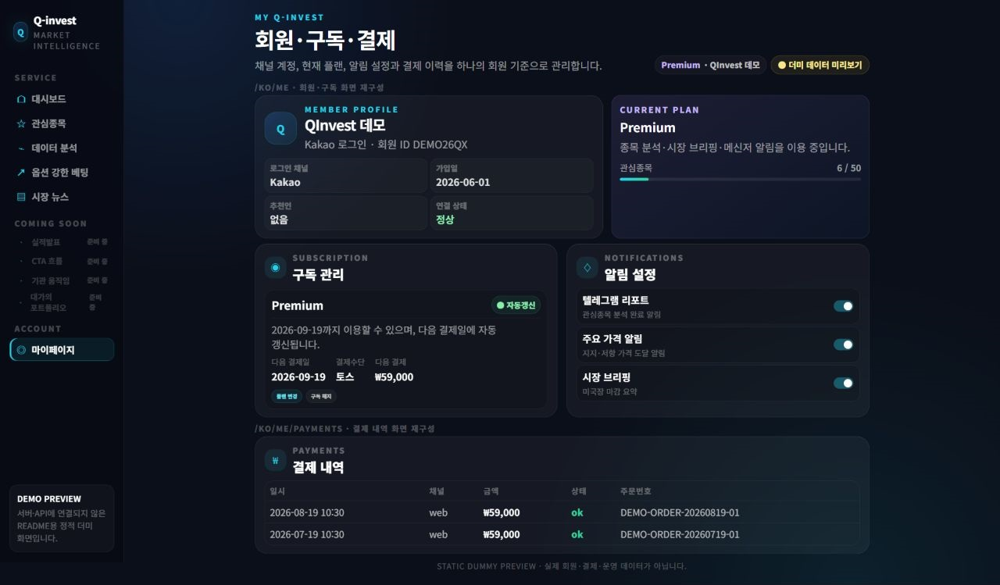</a></td>
    <td><a href="./assets/pricing-desktop-dummy.png">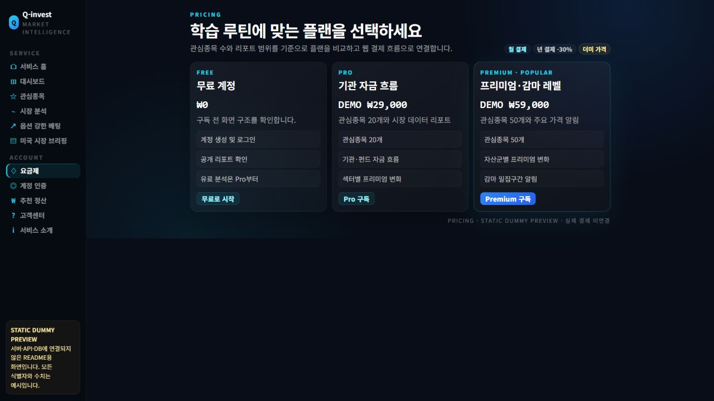</a></td>
  </tr>
  <tr>
    <td>연결 계정, 구독 상태, 관심 종목과 결제 이력을 하나의 회원 기준으로 관리합니다.</td>
    <td>이용 목적에 맞는 요금제와 제공 기능을 비교하고 가입 흐름으로 이동합니다.</td>
  </tr>
</table>

<details>
<summary><strong>가입·결제·고객지원 화면 더 보기</strong></summary>

<table>
  <tr>
    <th width="50%">시작 안내</th>
    <th width="50%">결제 상태</th>
  </tr>
  <tr>
    <td><a href="./assets/onboarding-desktop-dummy.png">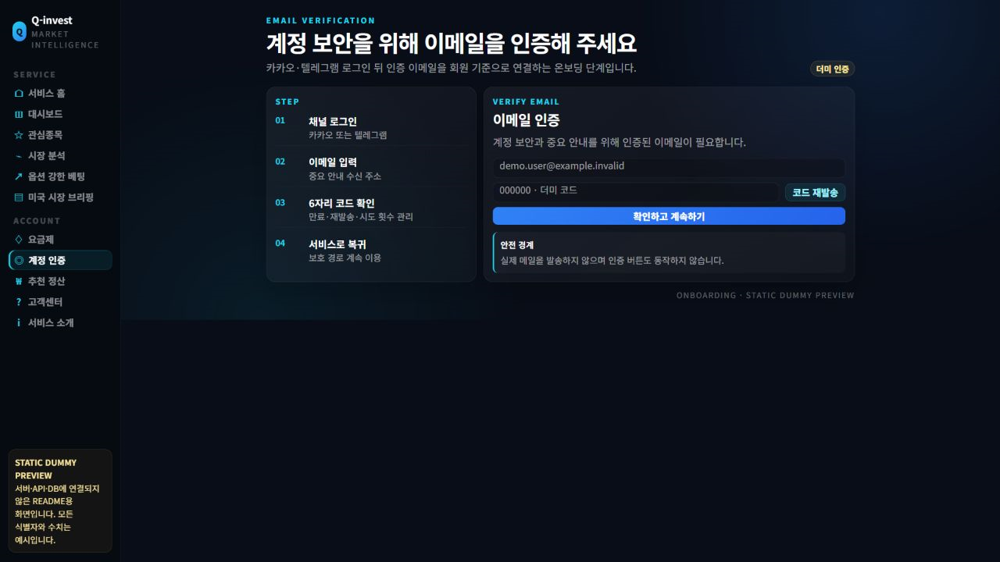</a></td>
    <td><a href="./assets/payment-complete-desktop-dummy.png">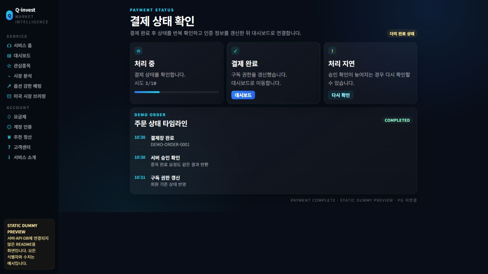</a></td>
  </tr>
  <tr>
    <td>가입 뒤 계정 연결과 관심 종목 설정 순서를 안내합니다.</td>
    <td>결제 처리 결과와 다음 이용 단계를 명확하게 안내합니다.</td>
  </tr>
  <tr>
    <th>추천 리워드</th>
    <th>고객센터 문의</th>
  </tr>
  <tr>
    <td><a href="./assets/referral-desktop-dummy.png">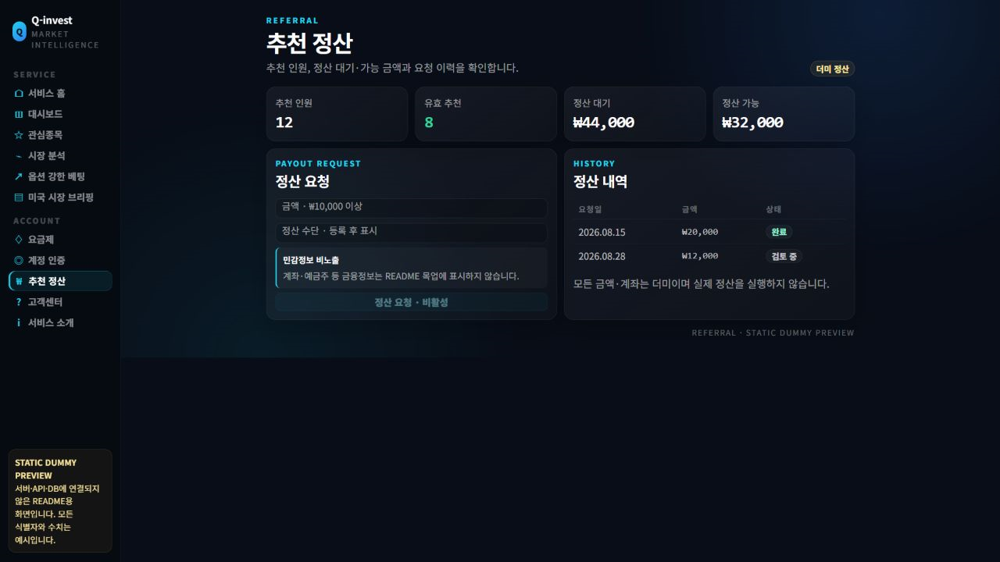</a></td>
    <td><a href="./assets/support-desktop-dummy.png">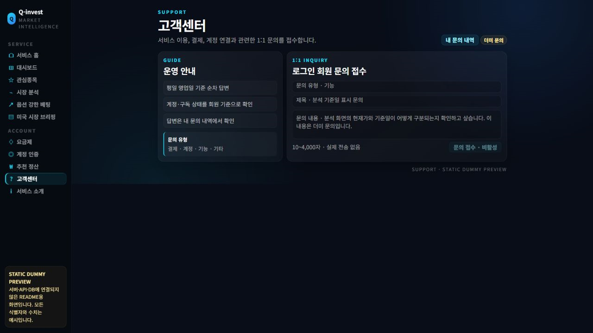</a></td>
  </tr>
  <tr>
    <td>추천 현황과 적립·정산 흐름을 회원 기준으로 확인합니다.</td>
    <td>문의 유형과 내용을 입력하고 지원 요청을 접수합니다.</td>
  </tr>
  <tr>
    <th>문의 접수 완료</th>
    <th>문의 내역</th>
  </tr>
  <tr>
    <td><a href="./assets/support-complete-desktop-dummy.png">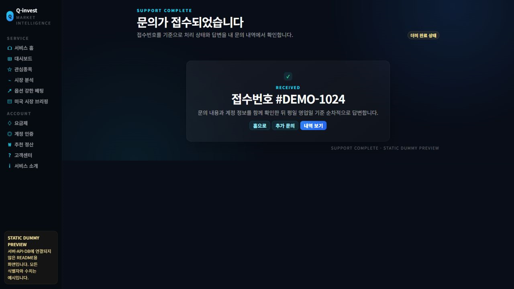</a></td>
    <td><a href="./assets/support-history-desktop-dummy.png">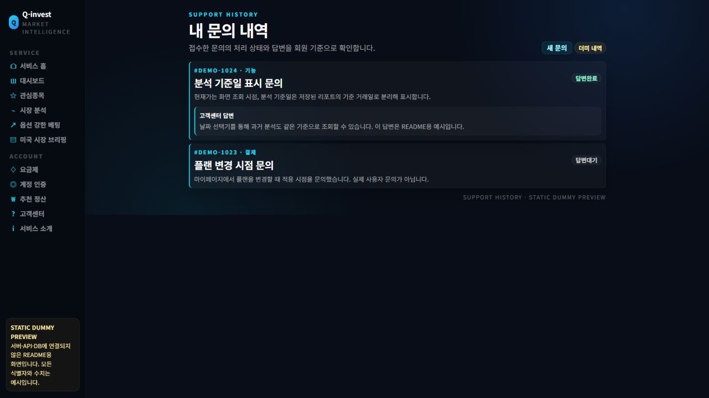</a></td>
  </tr>
  <tr>
    <td>문의 접수 결과와 이후 확인 방법을 안내합니다.</td>
    <td>접수한 문의와 처리 상태를 시간순으로 확인합니다.</td>
  </tr>
  <tr>
    <th>서비스 소개</th>
    <th>서비스 정책</th>
  </tr>
  <tr>
    <td><a href="./assets/about-desktop-dummy.png">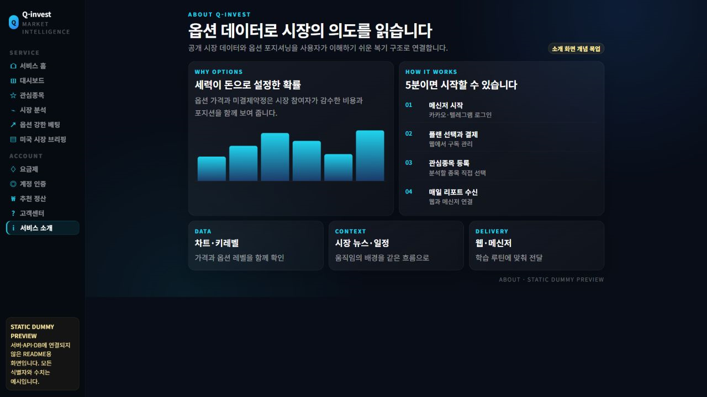</a></td>
    <td><a href="./assets/policies-desktop-dummy.png">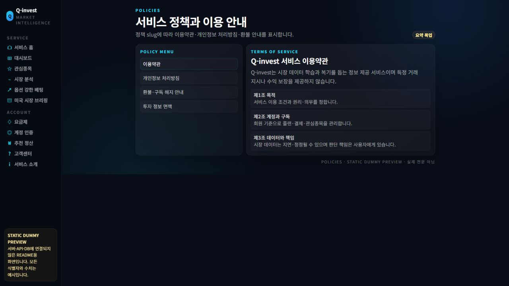</a></td>
  </tr>
  <tr>
    <td>QInvest의 시장 복기 목적과 제공 범위를 설명합니다.</td>
    <td>서비스 이용과 데이터 처리에 필요한 정책을 확인합니다.</td>
  </tr>
</table>

</details>

<details>
<summary><strong>관리자 화면 더 보기</strong></summary>

<table>
  <tr>
    <th width="50%">관리 홈</th>
    <th width="50%">사용자 목록</th>
  </tr>
  <tr>
    <td><a href="./assets/admin-home-desktop-dummy.png">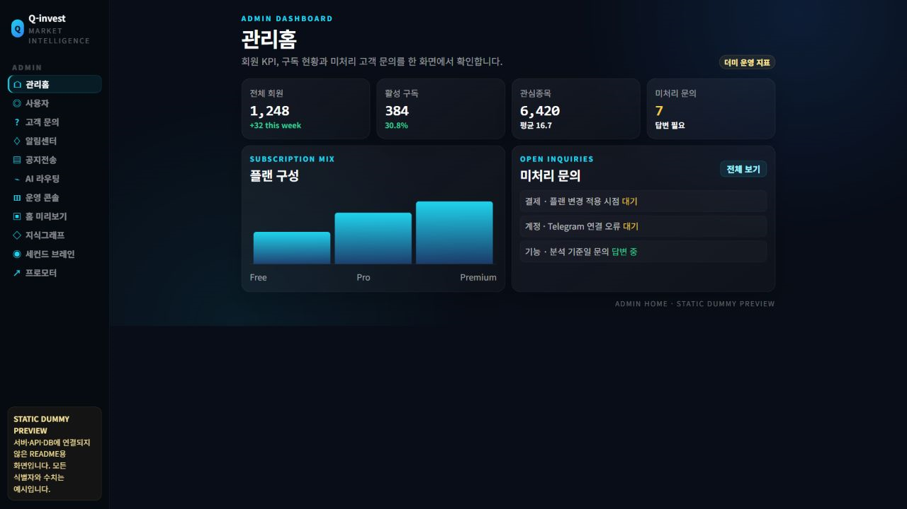</a></td>
    <td><a href="./assets/admin-users-desktop-dummy.png">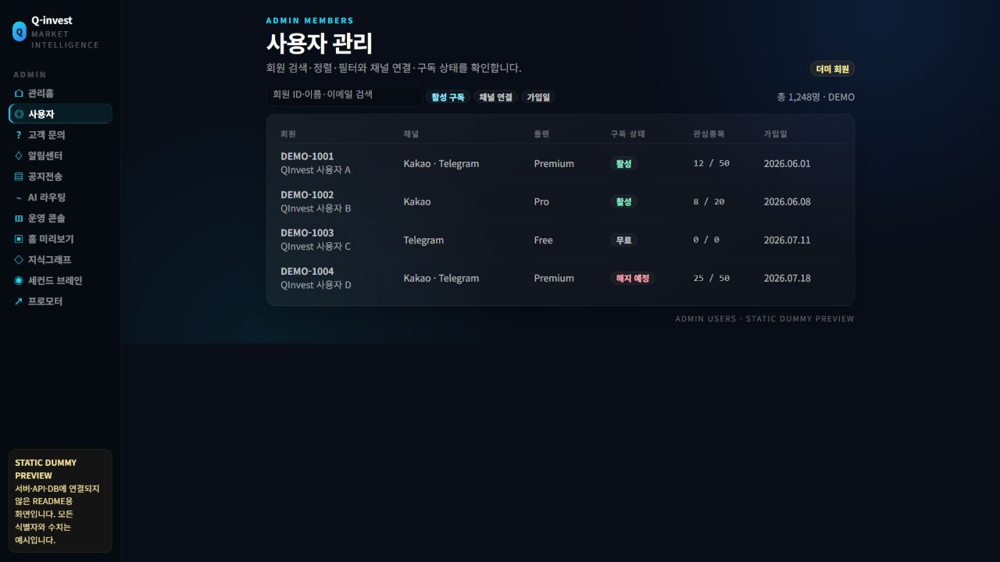</a></td>
  </tr>
  <tr>
    <td>회원, 문의, 알림과 분석 작업의 주요 상태를 요약합니다.</td>
    <td>사용자와 구독 상태를 검색하고 관리 대상으로 이동합니다.</td>
  </tr>
  <tr>
    <th>회원 상세</th>
    <th>고객 문의 관리</th>
  </tr>
  <tr>
    <td><a href="./assets/admin-user-detail-desktop-dummy.png">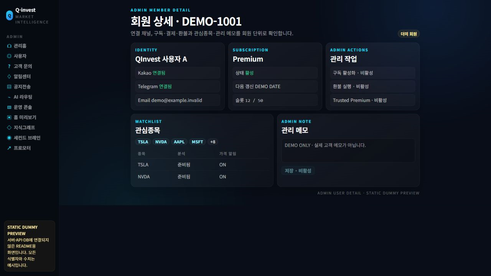</a></td>
    <td><a href="./assets/admin-inquiries-desktop-dummy.png">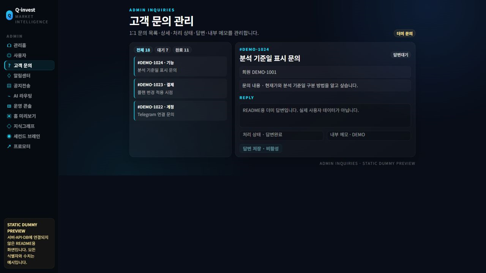</a></td>
  </tr>
  <tr>
    <td>한 회원의 연결 계정, 구독, 결제와 관심 종목을 함께 확인합니다.</td>
    <td>문의 내용과 처리 상태를 확인하고 답변 흐름을 관리합니다.</td>
  </tr>
  <tr>
    <th>공지 전송</th>
    <th>AI 라우팅</th>
  </tr>
  <tr>
    <td><a href="./assets/admin-broadcast-desktop-dummy.png">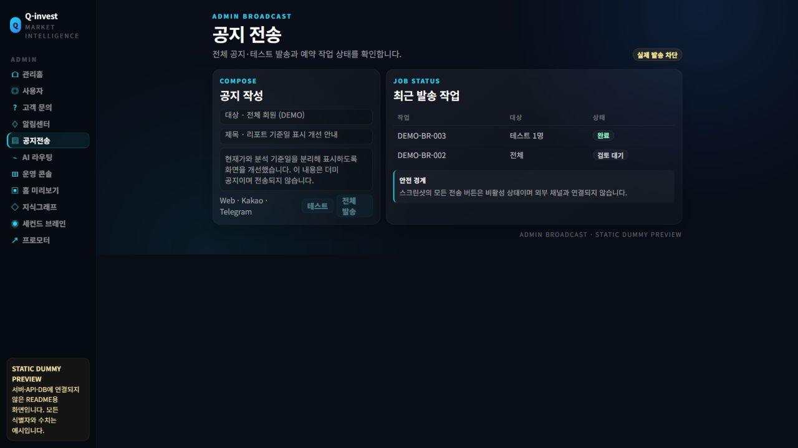</a></td>
    <td><a href="./assets/admin-ai-routing-desktop-dummy.png">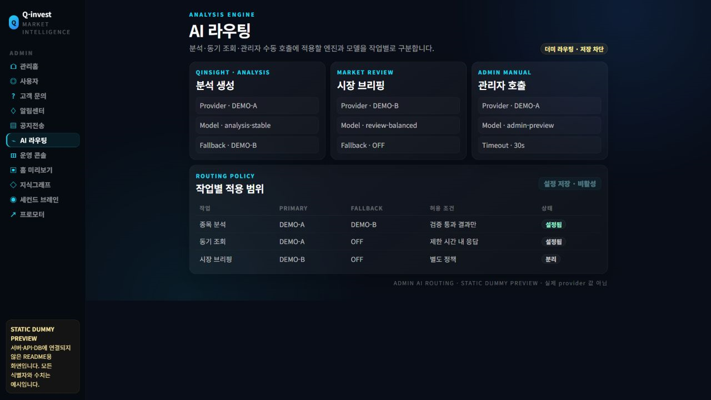</a></td>
  </tr>
  <tr>
    <td>대상과 채널을 선택하고 사람의 확인을 거쳐 공지를 준비합니다.</td>
    <td>요청 유형에 따라 분석·요약 작업의 처리 경로를 구성합니다.</td>
  </tr>
  <tr>
    <th>관리 콘솔</th>
    <th>홈 미리보기</th>
  </tr>
  <tr>
    <td><a href="./assets/admin-ops-desktop-dummy.jpg">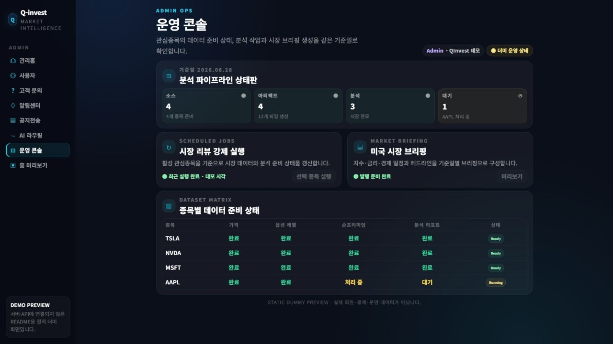</a></td>
    <td><a href="./assets/admin-home-preview-desktop-dummy.png">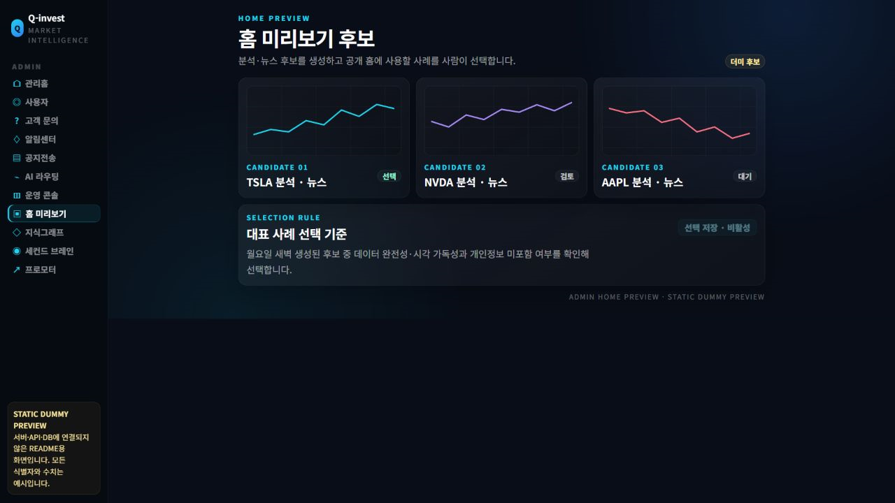</a></td>
  </tr>
  <tr>
    <td>분석 작업과 시장 브리핑 생성 상태를 같은 기준으로 확인합니다.</td>
    <td>공개 전 홈 콘텐츠의 구성과 노출 상태를 점검합니다.</td>
  </tr>
  <tr>
    <th colspan="2">콘텐츠 검토</th>
  </tr>
  <tr>
    <td colspan="2" align="center"><a href="./assets/admin-promoter-desktop-dummy.png">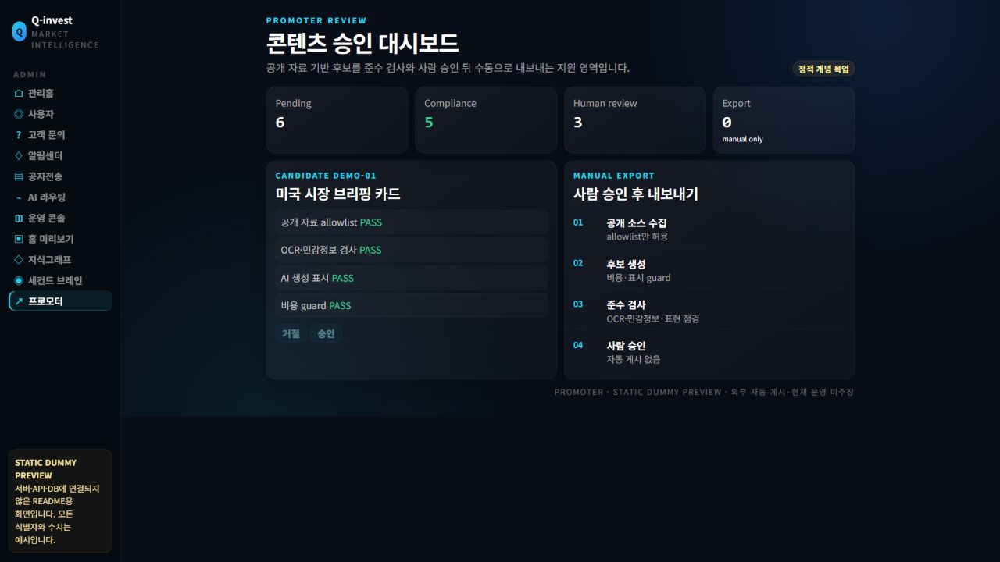</a></td>
  </tr>
  <tr>
    <td colspan="2" align="center">공개 자료를 바탕으로 만든 콘텐츠를 사람이 검토하고 내보냅니다.</td>
  </tr>
</table>

</details>

<a id="architecture"></a>

## 🏗️ 시스템 구성

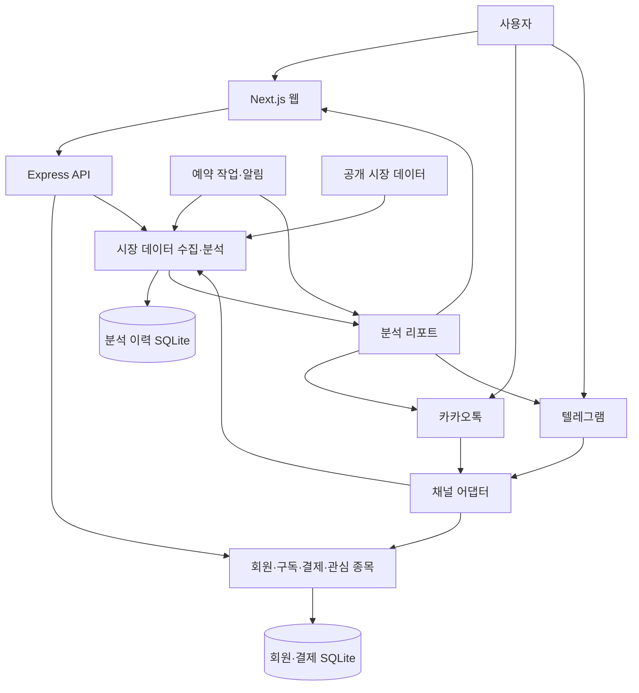
```mermaid
flowchart TB
    USER[사용자] --> WEB[Next.js 웹]
    USER --> KAKAO[카카오톡]
    USER --> TELEGRAM[텔레그램]

    WEB --> API[Express API]
    KAKAO --> CHANNEL[채널 어댑터]
    TELEGRAM --> CHANNEL

    API --> MEMBER[회원·구독·결제·관심 종목]
    CHANNEL --> MEMBER
    API --> ANALYSIS[시장 데이터 수집·분석]
    CHANNEL --> ANALYSIS
    JOBS[예약 작업·알림] --> ANALYSIS

    SOURCE[공개 시장 데이터] --> ANALYSIS
    MEMBER --> MEMBER_DB[(회원·결제 SQLite)]
    ANALYSIS --> HISTORY_DB[(분석 이력 SQLite)]
    ANALYSIS --> REPORT[분석 리포트]
    JOBS --> REPORT
    REPORT --> WEB
    REPORT --> KAKAO
    REPORT --> TELEGRAM
```

회원·결제처럼 정합성이 중요한 데이터와 용량·갱신 주기가 다른 분석 이력을 별도 DB 책임으로 나눴습니다. 하나의 서버 애플리케이션 안에서도 API, 채널 어댑터, 기능 모듈과 예약 작업의 책임을 분리해 변경 범위를 통제했습니다.

## 🗂️ 논리적 책임 구조

실제 저장소명과 내부 경로는 제외하고, 각 영역의 책임 경계가 보이도록 공개용 논리 구조로 정리했습니다.

```text
qinvest/
├─ web/                         # 사용자·관리자 웹
│  ├─ routes/                   # 화면과 라우팅
│  ├─ components/               # 기능 UI와 공통 컴포넌트
│  └─ clients/                  # API 클라이언트·타입·상태 연결
├─ api/                         # 회원·결제·분석·채널 API
│  ├─ domains/                  # 기능별 도메인 모듈
│  ├─ data/                     # SQLite·migration·스냅샷
│  ├─ jobs/                     # 예약 작업과 알림
│  └─ tests/                    # 위험 경로 회귀 테스트
├─ research/                    # 모의 데이터 기반 시장 연구
└─ content-support/             # 사람 검토 중심 콘텐츠 지원
```

연구 영역은 실거래와 분리해 모의 데이터 중심으로 검증하고, 콘텐츠 지원 영역은 공개 자료와 사람의 최종 검토를 전제로 구성했습니다.

## 🗃️ 데이터 모델

회원 ID를 채널·구독·결제·관심 종목의 단일 기준으로 두고, 분석 이력은 별도 저장소로 분리했습니다.

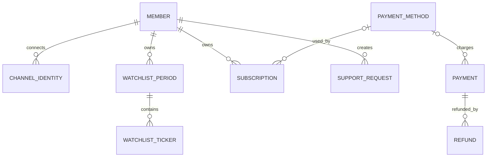
```mermaid
erDiagram
    MEMBER ||--o{ CHANNEL_IDENTITY : connects
    MEMBER ||--o{ WATCHLIST_PERIOD : owns
    WATCHLIST_PERIOD ||--o{ WATCHLIST_TICKER : contains
    MEMBER ||--o{ SUBSCRIPTION : owns
    MEMBER ||--o{ SUPPORT_REQUEST : creates
    PAYMENT_METHOD o|--o{ SUBSCRIPTION : used_by
    PAYMENT_METHOD o|--o{ PAYMENT : charges
    PAYMENT ||--o{ REFUND : refunded_by
```

- `MEMBER`: 웹·카카오톡·텔레그램 프로필을 통합하는 회원 기준
- `SUBSCRIPTION`: 구독 이력과 현재 이용 상태
- `PAYMENT_METHOD`·`PAYMENT`·`REFUND`: 결제수단과 결제·환불 이력
- `WATCHLIST_PERIOD`·`WATCHLIST_TICKER`: 이용 기간별 관심 종목과 알림 설정
- `SUPPORT_REQUEST`: 회원 문의와 처리 상태
- `ANALYSIS_HISTORY`: 종목·기준일별 결과를 보관하는 별도 분석 이력 DB

분석 이력 DB는 회원·결제 DB와 직접 결합하지 않고, 종목과 분석 기준일을 중심으로 저장합니다. 전체 테이블과 컬럼 대신 서비스 흐름을 이해하는 데 필요한 관계만 공개했습니다.

<a id="decisions"></a>

## 🧠 핵심 기술 의사결정

### 1. 채널별 계정을 회원 ID 하나로 통합

웹·카카오톡·텔레그램이 각자 회원 상태를 가지면 구독과 관심 종목의 기준이 달라질 수 있습니다. 채널 프로필은 연결 정보로 두고 구독·결제·관심 종목은 회원 ID를 단일 기준으로 사용했습니다. 회원 통합 과정에서는 활성 구독, 성공 결제, 인증 이메일과 관리자 권한이 충돌하지 않는지를 별도 테스트로 확인했습니다.

### 2. 현재 단계에서는 SQLite를 유지

기술 교체 자체보다 현재 쓰기 패턴과 복구 가능성을 먼저 봤습니다. 현재 구성에서는 WAL과 외래키 제약을 적용한 SQLite를 유지했습니다. 확장이 필요하면 분석 작업과 API의 프로세스 분리를 먼저 검토하고, 다중 API 인스턴스와 실제 쓰기 경합이 발생할 때 회원·결제 DB부터 PostgreSQL로 옮기며, 공유 큐·캐시·락이 필요할 때 Redis를 도입하도록 전환 조건을 정했습니다.

### 3. 실패 비용이 큰 흐름부터 검증

정상 화면 수보다 회원 병합, 결제 중복, migration 부분 적용, 분석 작업 재시도와 백업 손상처럼 되돌리기 어려운 경로를 먼저 테스트했습니다. 같은 요청의 재실행, 충돌, 부분 실패와 복구를 별도 시나리오로 다뤘습니다.

### 4. 기능 완성과 출시 조건을 분리

기능 구현 여부와 외부 공개 승인 기준을 분리했습니다. 민감정보 보호, 기존 데이터 이관과 복구 가능성은 기능 목록과 별도의 출시 조건으로 검증하고 있습니다.

<a id="backup-recovery"></a>

## 🛡️ 백업·복구 설계

구현한 백업·복구 흐름에서 핵심 설계 원칙만 정리했습니다.

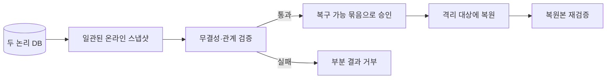
```mermaid
flowchart LR
    DB[(두 논리 DB)] --> SNAPSHOT[일관된 온라인 스냅샷]
    SNAPSHOT --> CHECK[무결성·관계 검증]
    CHECK -->|통과| ACCEPT[복구 가능 묶음으로 승인]
    CHECK -->|실패| REJECT[부분 결과 거부]
    ACCEPT --> ISOLATE[격리 대상에 복원]
    ISOLATE --> RECHECK[복원본 재검증]
```

- 실행 중인 DB를 단순 파일 복사하지 않고 일관된 스냅샷으로 생성
- 두 논리 DB 중 하나라도 검증에 실패하면 부분 결과를 성공본으로 인정하지 않음
- 기존 데이터를 바로 덮어쓰지 않고 격리된 대상에 복원한 뒤 다시 검증
- 코드와 회귀 테스트로 확인한 복구 동작과 실제 운영 복구 목표 달성을 구분

<a id="development-validation"></a>

## 🧪 개발·검증 방식

- 기능과 수정 작업을 브랜치로 분리하고 `feat:`, `fix:`, `docs:`, `chore:`, `test:`, `refactor:`처럼 목적이 드러나는 커밋 접두어를 사용했습니다.
- 백엔드는 회원 통합, 결제 중복 방지·환불, migration, 분석 작업의 중복 실행 방지·재시도, SQLite 백업·복구를 Jest 테스트로 다뤘습니다.
- 프론트엔드는 TypeScript 검사와 build를 기본 검증으로 두고, 일부 화면은 재사용 Playwright 스크립트로 모바일부터 대형 화면까지 반응형 경계를 확인했습니다.
- 실패 비용을 먼저 정한 뒤 소스·테스트·문서를 같은 변경 단위로 동기화했습니다.

<a id="technology"></a>

## 🧰 기술 구성

| 영역 | 기술 |
|---|---|
| Web | Next.js, React, TypeScript, Tailwind CSS |
| API·Channel | Node.js, Express, Telegraf, Kakao API |
| Data | SQLite, `better-sqlite3`, migration, scheduled jobs |
| Test | Jest, TypeScript·build 검사, Playwright 검증 스크립트 |

## 📌 현재 상태

| 구분 | 확인된 상태 |
|---|---|
| 핵심 제품 | 회원·구독·관심 종목·분석·브리핑·운영자 기능 구현 |
| 데이터 안정성 | 온라인 스냅샷, 검증, 격리 복구 코드와 회귀 테스트 구현 |
| 공개 출시 | 민감정보 보호·기존 데이터 이관·복구 조건 검증 중 |

QInvest는 학습용 시장 복기·알림 정보 서비스이며 투자 판단을 대신하지 않습니다. 이 문서는 현재 코드와 테스트에서 확인한 구현 범위를 설명하며, 상용 출시·실사용 성과·투자 수익률을 주장하지 않습니다.

QInvest는 기능 수를 늘리는 것만큼 회원·결제의 단일 기준, 재실행 안전성, 복구 가능한 데이터 경계와 출시 조건을 함께 설계한 프로젝트입니다.
